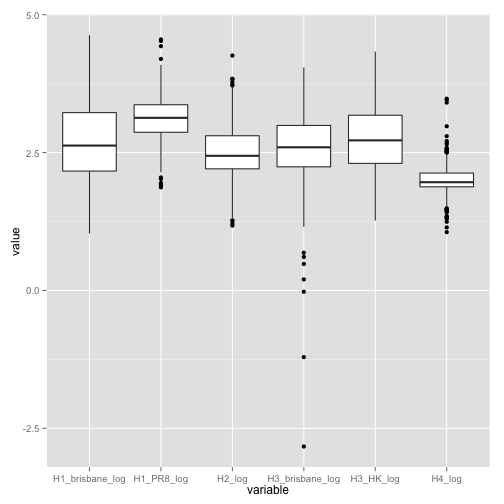
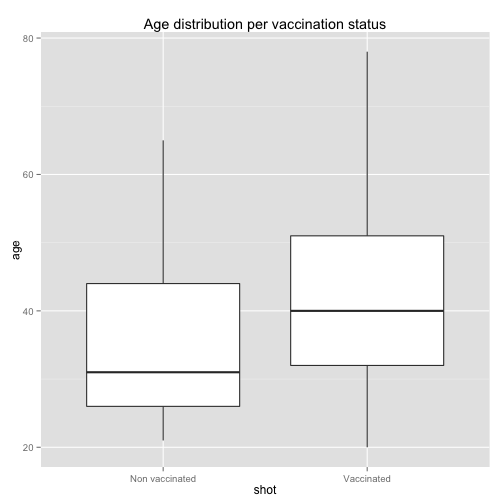

Load and clean the data
-----------------------

<a id="data"></a>
## Data
Donors data were taken from the file `donors_view.csv` in the `data/` directory.
We excluded donors enrolled in the Novartis study, HIV positive and those for
which the number of vaccinations is not defined.

Data were loaded from several csv files (one per strain) and merged into two
dataframes, one for IC50 values and one for the EC50 values.


```
## [1] "dimension of donors_view"
```

```
## [1] 305  16
```


The age distribution per gender is shown in the next plot.

 


## Data cleaning
IC_50 could not be computed for H5 and H7. For these two strains, rather than
the inhibitory concentrations, the inhibition value at the first dilution is
reported, expressed in percentage.

EC50 data present two outliers (one in H2 and one in H4 titers): their value
for effective concentration was lower than -40 (in log scale) and for this
reason were removed.

```r
ec_data$H2_log[ec_data$H2_log < -40] <- NA
ec_data$H4_log[ec_data$H4_log < -40] <- NA
```


The following plots show the distribution of values, one boxplot per strain.
IC50 for H5 and H7 are shown separately because the scale is different
(percentage).

#### IC50
  

#### EC50
 


### Merge with donors data
Exclude donoros for which the vaccinations number is not defined.

```
## [1] 273  25
```

```
## [1] 273  26
```

We are left with 273 donors, 142 females and 131 males, for which we can plot
the following characteristics.

 

```
##                 
##                   F  M
##   Non vaccinated 56 48
##   Vaccinated     86 83
```

 


It is important to point out that the groups are not homogeneous, vaccinated
are older than non vaccinated, as seen in the plot below.

 


We show the boxplots again, limited to donors considered here.
#### IC50
  


H3 Brisbane has a few outliers: we remove those below zero.

```r
ic_data$H3_brisbane_log[ic_data$H3_brisbane_log < 0] <- NA
```


#### EC50
 


We observe a few strain with outliers: H1 pandemic 2009, H2 and H4. We remove
the lowest observation on each strain.


```r
ec_data$H1_pdm09_log[ec_data$H1_pdm09_log < 0] <- NA
ec_data$H2_log[ec_data$H2_log < -3] <- NA
ec_data$H4_log[ec_data$H4_log < -1.5] <- NA
```


#### Count the valid data (those that are not reported as `NA`) on each strain.
For **IC** first

```r
for (str in names(ic_data)[2:9]) {
    n <- sum(!is.na(ic_data[[str]]))
    print(paste(str, "-->", n))
}
```

```
## [1] "H1_brisbane_log --> 249"
## [1] "H1_PR8_log --> 259"
## [1] "H2_log --> 265"
## [1] "H3_brisbane_log --> 252"
## [1] "H3_HK_log --> 264"
## [1] "H4_log --> 246"
## [1] "H5_1st_dil_percent --> 273"
## [1] "H7_1st_dil_percent --> 273"
```


and then for **EC**

```r
for (str in names(ec_data)[2:10]) {
    n <- sum(!is.na(ec_data[[str]]))
    print(paste(str, "-->", n))
}
```

```
## [1] "H1_pdm09_log --> 272"
## [1] "H1_PR8_log --> 273"
## [1] "H12_log --> 273"
## [1] "H2_log --> 270"
## [1] "H3_log --> 273"
## [1] "H4_log --> 267"
## [1] "H5_log --> 273"
## [1] "H7_vir_log --> 273"
## [1] "H7_log --> 273"
```

For all 273 donors the variable `shot` is defined (Vaccinated or Non
vaccinated).

----

Save everything, it will be loaded in other files.

```r
save(ic_data, ec_data, file = "ic_ec.Rdata")
```

----

#### _Latest update: 26 November 2013_.
