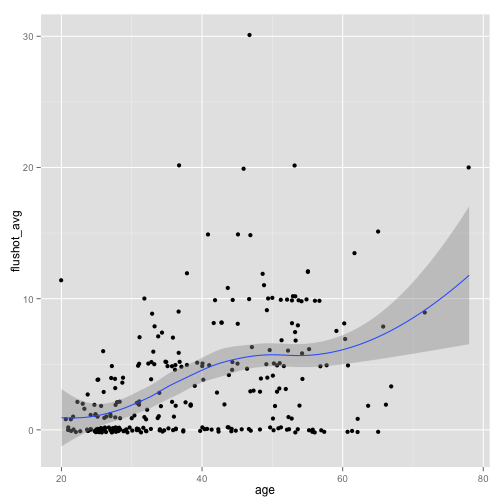
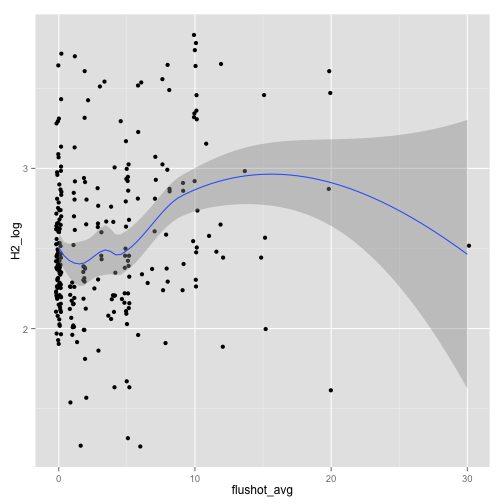

Repeating the analysis done in STATA
------------------------------------
### Divide the flu shots in categories, ANOVA for the antibody titers.

#### IC50
We define categories for shots: no shots, between 1 and 3, more than 3.


Here below whether different categories have different titers.


```r
fit_H1_B <- aov(H1_brisbane_log ~ ternary_shot, data = ic_data)
summary(fit_H1_B)
```

```
##               Df Sum Sq Mean Sq F value  Pr(>F)    
## ternary_shot   2     17    8.48      20 9.4e-09 ***
## Residuals    244    104    0.43                    
## ---
## Signif. codes:  0 '***' 0.001 '**' 0.01 '*' 0.05 '.' 0.1 ' ' 1 
## 24 observations deleted due to missingness
```

```r

fit_H1_P <- aov(H1_PR8_log ~ ternary_shot, data = ic_data)
summary(fit_H1_P)
```

```
##               Df Sum Sq Mean Sq F value  Pr(>F)    
## ternary_shot   2    3.5   1.746    10.4 4.7e-05 ***
## Residuals    254   42.7   0.168                    
## ---
## Signif. codes:  0 '***' 0.001 '**' 0.01 '*' 0.05 '.' 0.1 ' ' 1 
## 14 observations deleted due to missingness
```

```r

fit_H2 <- aov(H2_log ~ ternary_shot, data = ic_data)
summary(fit_H2)
```

```
##               Df Sum Sq Mean Sq F value Pr(>F)   
## ternary_shot   2    2.3   1.134    4.79  0.009 **
## Residuals    260   61.5   0.237                  
## ---
## Signif. codes:  0 '***' 0.001 '**' 0.01 '*' 0.05 '.' 0.1 ' ' 1 
## 8 observations deleted due to missingness
```

```r

fit_H3_B <- aov(H3_brisbane_log ~ ternary_shot, data = ic_data)
summary(fit_H3_B)
```

```
##               Df Sum Sq Mean Sq F value Pr(>F)  
## ternary_shot   2    3.4    1.69    4.33  0.014 *
## Residuals    247   96.4    0.39                 
## ---
## Signif. codes:  0 '***' 0.001 '**' 0.01 '*' 0.05 '.' 0.1 ' ' 1 
## 21 observations deleted due to missingness
```

```r

fit_H3_H <- aov(H3_HK_log ~ ternary_shot, data = ic_data)
summary(fit_H3_H)
```

```
##               Df Sum Sq Mean Sq F value  Pr(>F)    
## ternary_shot   2    5.2   2.607    8.27 0.00033 ***
## Residuals    259   81.6   0.315                    
## ---
## Signif. codes:  0 '***' 0.001 '**' 0.01 '*' 0.05 '.' 0.1 ' ' 1 
## 9 observations deleted due to missingness
```

```r

fit_H4 <- aov(H4_log ~ ternary_shot, data = ic_data)
summary(fit_H4)
```

```
##               Df Sum Sq Mean Sq F value Pr(>F)
## ternary_shot   2   0.09  0.0428    0.53   0.59
## Residuals    241  19.39  0.0805               
## 27 observations deleted due to missingness
```


#### EC50
Same as above 

```
## [1] TRUE
```


```r
fit_H1_pdm <- aov(H1_pdm09_log ~ ternary_shot, data = ec_data)
summary(fit_H1_pdm)
```

```
##               Df Sum Sq Mean Sq F value  Pr(>F)    
## ternary_shot   2   4.26   2.131    22.1 1.3e-09 ***
## Residuals    267  25.75   0.096                    
## ---
## Signif. codes:  0 '***' 0.001 '**' 0.01 '*' 0.05 '.' 0.1 ' ' 1 
## 1 observation deleted due to missingness
```

```r

fit_H1_PR8 <- aov(H1_PR8_log ~ ternary_shot, data = ec_data)
summary(fit_H1_PR8)
```

```
##               Df Sum Sq Mean Sq F value Pr(>F)    
## ternary_shot   2   9.73    4.86    42.7 <2e-16 ***
## Residuals    268  30.54    0.11                   
## ---
## Signif. codes:  0 '***' 0.001 '**' 0.01 '*' 0.05 '.' 0.1 ' ' 1
```

```r

fit_H12 <- aov(H12_log ~ ternary_shot, data = ec_data)
summary(fit_H12)
```

```
##               Df Sum Sq Mean Sq F value Pr(>F)
## ternary_shot   2    0.8   0.397    1.86   0.16
## Residuals    268   57.1   0.213
```

```r

fit_H2 <- aov(H2_log ~ ternary_shot, data = ec_data)
summary(fit_H2)
```

```
##               Df Sum Sq Mean Sq F value  Pr(>F)    
## ternary_shot   2   11.2    5.62    14.7 8.6e-07 ***
## Residuals    265  101.1    0.38                    
## ---
## Signif. codes:  0 '***' 0.001 '**' 0.01 '*' 0.05 '.' 0.1 ' ' 1 
## 3 observations deleted due to missingness
```

```r

fit_H3 <- aov(H3_log ~ ternary_shot, data = ec_data)
summary(fit_H3)
```

```
##               Df Sum Sq Mean Sq F value Pr(>F)  
## ternary_shot   2    1.5   0.731    2.98  0.053 .
## Residuals    268   65.8   0.246                 
## ---
## Signif. codes:  0 '***' 0.001 '**' 0.01 '*' 0.05 '.' 0.1 ' ' 1
```

```r

fit_H4 <- aov(H4_log ~ ternary_shot, data = ec_data)
summary(fit_H4)
```

```
##               Df Sum Sq Mean Sq F value Pr(>F)  
## ternary_shot   2    2.5   1.229    2.79  0.063 .
## Residuals    262  115.4   0.441                 
## ---
## Signif. codes:  0 '***' 0.001 '**' 0.01 '*' 0.05 '.' 0.1 ' ' 1 
## 6 observations deleted due to missingness
```

```r

fit_H5 <- aov(H5_log ~ ternary_shot, data = ec_data)
summary(fit_H5)
```

```
##               Df Sum Sq Mean Sq F value  Pr(>F)    
## ternary_shot   2    9.9    4.94    19.8 9.6e-09 ***
## Residuals    268   66.9    0.25                    
## ---
## Signif. codes:  0 '***' 0.001 '**' 0.01 '*' 0.05 '.' 0.1 ' ' 1
```

```r

fit_H7_vir <- aov(H7_vir_log ~ ternary_shot, data = ec_data)
summary(fit_H7_vir)
```

```
##               Df Sum Sq Mean Sq F value Pr(>F)
## ternary_shot   2   0.32  0.1603    2.13   0.12
## Residuals    268  20.15  0.0752
```

```r

fit_H7 <- aov(H7_log ~ ternary_shot, data = ec_data)
summary(fit_H7)
```

```
##               Df Sum Sq Mean Sq F value Pr(>F)
## ternary_shot   2   0.27  0.1351     1.7   0.18
## Residuals    268  21.24  0.0793
```


### Comment
There is an effect of vaccinations pretty much everywhere. Exceptions are,  
for the IC50:
- H3 Brisbane (small effect),
- H4.

For the EC50 they are:
- H12,
- H3,
- H4,
- H7 virus,
- H7.

On the other hand we already knew it, since flu shots increase with age.

```r
library(ggplot2)
library(MASS)
p <- ggplot(data = ic_data, aes(x = age, y = flushot_avg)) + geom_jitter()
p <- p + geom_smooth(method = "loess")
p
```

 


Do titers increase with the shots alone? This is more difficult to see from a
plot only. For example, the smoothing below shows a moderate increase of H2
titer for a range of shuts between zero and ten.

```r
p <- ggplot(data = ic_data, aes(x = flushot_avg, H2_log)) + geom_jitter()
p <- p + geom_smooth(method = "loess")
p
```

 


In my opinion, the correct way to discern the effect of age and vaccinations is
to perform a regression with both terms and compare it to a regression with the
age only. We do it for H2, IC50 data.


```r
fit_1 <- glm(H2_log ~ age, data = ic_data)
summary(fit_1)
```

```
## 
## Call:
## glm(formula = H2_log ~ age, data = ic_data)
## 
## Deviance Residuals: 
##     Min       1Q   Median       3Q      Max  
## -1.2040  -0.2083   0.0085   0.2240   0.9580  
## 
## Coefficients:
##             Estimate Std. Error t value Pr(>|t|)    
## (Intercept)   1.5364     0.0784    19.6   <2e-16 ***
## age           0.0257     0.0019    13.6   <2e-16 ***
## ---
## Signif. codes:  0 '***' 0.001 '**' 0.01 '*' 0.05 '.' 0.1 ' ' 1 
## 
## (Dispersion parameter for gaussian family taken to be 0.1433)
## 
##     Null deviance: 63.781  on 262  degrees of freedom
## Residual deviance: 37.410  on 261  degrees of freedom
##   (8 observations deleted due to missingness)
## AIC: 239.5
## 
## Number of Fisher Scoring iterations: 2
```

```r

fit_0 <- glm(H2_log ~ age + flushot_avg, data = ic_data)
summary(fit_0)
```

```
## 
## Call:
## glm(formula = H2_log ~ age + flushot_avg, data = ic_data)
## 
## Deviance Residuals: 
##     Min       1Q   Median       3Q      Max  
## -1.2062  -0.2060   0.0003   0.2172   0.9772  
## 
## Coefficients:
##             Estimate Std. Error t value Pr(>|t|)    
## (Intercept)  1.52586    0.07963   19.16   <2e-16 ***
## age          0.02640    0.00208   12.67   <2e-16 ***
## flushot_avg -0.00428    0.00559   -0.77     0.44    
## ---
## Signif. codes:  0 '***' 0.001 '**' 0.01 '*' 0.05 '.' 0.1 ' ' 1 
## 
## (Dispersion parameter for gaussian family taken to be 0.1436)
## 
##     Null deviance: 63.781  on 262  degrees of freedom
## Residual deviance: 37.325  on 260  degrees of freedom
##   (8 observations deleted due to missingness)
## AIC: 240.9
## 
## Number of Fisher Scoring iterations: 2
```

The coefficient for the shots is very close to zero, and can be removed.


<a id="done_stata"></a>
## 
