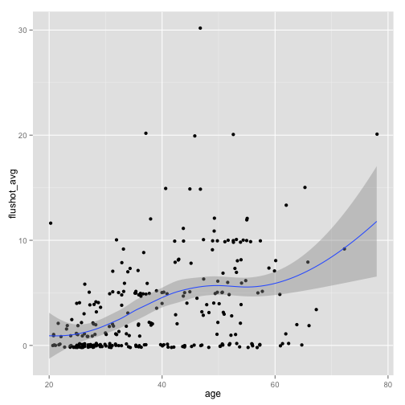

Repeating the analysis done in STATA
------------------------------------
### Divide the flu shots in categories, ANOVA for the antibody titers.

#### IC50
We define categories for shots: no shots, between 1 and 3, more than 3.


Here below whether different categories have different titers.


```r
fit_H1_B <- aov(H1_brisbane_log ~ ternary_shot, data = ic_data)
summary(fit_H1_B)
```

```
##               Df Sum Sq Mean Sq F value  Pr(>F)    
## ternary_shot   2   16.5    8.23    19.4 1.5e-08 ***
## Residuals    246  104.5    0.42                    
## ---
## Signif. codes:  0 '***' 0.001 '**' 0.01 '*' 0.05 '.' 0.1 ' ' 1 
## 24 observations deleted due to missingness
```

```r

fit_H1_P <- aov(H1_PR8_log ~ ternary_shot, data = ic_data)
summary(fit_H1_P)
```

```
##               Df Sum Sq Mean Sq F value  Pr(>F)    
## ternary_shot   2    3.4   1.712    10.2 5.4e-05 ***
## Residuals    256   42.9   0.168                    
## ---
## Signif. codes:  0 '***' 0.001 '**' 0.01 '*' 0.05 '.' 0.1 ' ' 1 
## 14 observations deleted due to missingness
```

```r

fit_H2 <- aov(H2_log ~ ternary_shot, data = ic_data)
summary(fit_H2)
```

```
##               Df Sum Sq Mean Sq F value Pr(>F)  
## ternary_shot   2    2.1   1.038    4.31  0.014 *
## Residuals    262   63.1   0.241                 
## ---
## Signif. codes:  0 '***' 0.001 '**' 0.01 '*' 0.05 '.' 0.1 ' ' 1 
## 8 observations deleted due to missingness
```

```r

fit_H3_B <- aov(H3_brisbane_log ~ ternary_shot, data = ic_data)
summary(fit_H3_B)
```

```
##               Df Sum Sq Mean Sq F value Pr(>F)  
## ternary_shot   2    3.2   1.588    4.08  0.018 *
## Residuals    249   96.8   0.389                 
## ---
## Signif. codes:  0 '***' 0.001 '**' 0.01 '*' 0.05 '.' 0.1 ' ' 1 
## 21 observations deleted due to missingness
```

```r

fit_H3_H <- aov(H3_HK_log ~ ternary_shot, data = ic_data)
summary(fit_H3_H)
```

```
##               Df Sum Sq Mean Sq F value  Pr(>F)    
## ternary_shot   2    5.0   2.493    7.87 0.00048 ***
## Residuals    261   82.7   0.317                    
## ---
## Signif. codes:  0 '***' 0.001 '**' 0.01 '*' 0.05 '.' 0.1 ' ' 1 
## 9 observations deleted due to missingness
```

```r

fit_H4 <- aov(H4_log ~ ternary_shot, data = ic_data)
summary(fit_H4)
```

```
##               Df Sum Sq Mean Sq F value Pr(>F)
## ternary_shot   2   0.08  0.0417    0.52   0.59
## Residuals    243  19.40  0.0798               
## 27 observations deleted due to missingness
```


#### EC50
Same as above 

```
## [1] TRUE
```


```r
fit_H1_pdm <- aov(H1_pdm09_log ~ ternary_shot, data = ec_data)
summary(fit_H1_pdm)
```

```
##               Df Sum Sq Mean Sq F value  Pr(>F)    
## ternary_shot   2   3.99   1.996    20.4 5.9e-09 ***
## Residuals    269  26.38   0.098                    
## ---
## Signif. codes:  0 '***' 0.001 '**' 0.01 '*' 0.05 '.' 0.1 ' ' 1 
## 1 observation deleted due to missingness
```

```r

fit_H1_PR8 <- aov(H1_PR8_log ~ ternary_shot, data = ec_data)
summary(fit_H1_PR8)
```

```
##               Df Sum Sq Mean Sq F value Pr(>F)    
## ternary_shot   2   9.53    4.76    41.8 <2e-16 ***
## Residuals    270  30.78    0.11                   
## ---
## Signif. codes:  0 '***' 0.001 '**' 0.01 '*' 0.05 '.' 0.1 ' ' 1
```

```r

fit_H12 <- aov(H12_log ~ ternary_shot, data = ec_data)
summary(fit_H12)
```

```
##               Df Sum Sq Mean Sq F value Pr(>F)
## ternary_shot   2    0.8   0.397    1.87   0.16
## Residuals    270   57.2   0.212
```

```r

fit_H2 <- aov(H2_log ~ ternary_shot, data = ec_data)
summary(fit_H2)
```

```
##               Df Sum Sq Mean Sq F value  Pr(>F)    
## ternary_shot   2   10.6    5.28    13.5 2.7e-06 ***
## Residuals    267  104.6    0.39                    
## ---
## Signif. codes:  0 '***' 0.001 '**' 0.01 '*' 0.05 '.' 0.1 ' ' 1 
## 3 observations deleted due to missingness
```

```r

fit_H3 <- aov(H3_log ~ ternary_shot, data = ec_data)
summary(fit_H3)
```

```
##               Df Sum Sq Mean Sq F value Pr(>F)  
## ternary_shot   2    1.6   0.813    3.31  0.038 *
## Residuals    270   66.4   0.246                 
## ---
## Signif. codes:  0 '***' 0.001 '**' 0.01 '*' 0.05 '.' 0.1 ' ' 1
```

```r

fit_H4 <- aov(H4_log ~ ternary_shot, data = ec_data)
summary(fit_H4)
```

```
##               Df Sum Sq Mean Sq F value Pr(>F)  
## ternary_shot   2    2.6    1.28    2.92  0.056 .
## Residuals    264  116.0    0.44                 
## ---
## Signif. codes:  0 '***' 0.001 '**' 0.01 '*' 0.05 '.' 0.1 ' ' 1 
## 6 observations deleted due to missingness
```

```r

fit_H5 <- aov(H5_log ~ ternary_shot, data = ec_data)
summary(fit_H5)
```

```
##               Df Sum Sq Mean Sq F value  Pr(>F)    
## ternary_shot   2    9.6    4.81    19.2 1.7e-08 ***
## Residuals    270   67.8    0.25                    
## ---
## Signif. codes:  0 '***' 0.001 '**' 0.01 '*' 0.05 '.' 0.1 ' ' 1
```

```r

fit_H7_vir <- aov(H7_vir_log ~ ternary_shot, data = ec_data)
summary(fit_H7_vir)
```

```
##               Df Sum Sq Mean Sq F value Pr(>F)
## ternary_shot   2    0.3  0.1503    2.01   0.14
## Residuals    270   20.2  0.0748
```

```r

fit_H7 <- aov(H7_log ~ ternary_shot, data = ec_data)
summary(fit_H7)
```

```
##               Df Sum Sq Mean Sq F value Pr(>F)
## ternary_shot   2   0.27  0.1374    1.73   0.18
## Residuals    270  21.44  0.0794
```


### Comment
There is an effect of vaccinations pretty much everywhere. Exceptions are,  
for the IC50:
- H3 Brisbane (small effect),
- H4.

For the EC50 they are:
- H12,
- H3,
- H4,
- H7 virus,
- H7.

On the other hand we already knew it, since flu shots increase with age.

```r
library(ggplot2)
library(MASS)
p <- ggplot(data = ic_data, aes(x = age, y = flushot_avg)) + geom_jitter()
p <- p + geom_smooth(method = "loess")
p
```

 


Do titers increase with the shots alone? This is more difficult to see from a
plot only. For example, the smoothing below shows a moderate increase of H2
titer for a range of shuts between zero and ten.

```r
p <- ggplot(data = ic_data, aes(x = flushot_avg, H2_log)) + geom_jitter()
p <- p + geom_smooth(method = "loess")
p
```

 


In my opinion, the correct way to discern the effect of age and vaccinations is
to perform a regression with both terms and compare it to a regression with the
age only. We do it for H2, IC50 data.


```r
fit_1 <- glm(H2_log ~ age, data = ic_data)
summary(fit_1)
```

```
## 
## Call:
## glm(formula = H2_log ~ age, data = ic_data)
## 
## Deviance Residuals: 
##     Min       1Q   Median       3Q      Max  
## -1.2099  -0.2101   0.0064   0.2264   0.9521  
## 
## Coefficients:
##             Estimate Std. Error t value Pr(>|t|)    
## (Intercept)  1.52469    0.07817    19.5   <2e-16 ***
## age          0.02608    0.00189    13.8   <2e-16 ***
## ---
## Signif. codes:  0 '***' 0.001 '**' 0.01 '*' 0.05 '.' 0.1 ' ' 1 
## 
## (Dispersion parameter for gaussian family taken to be 0.1439)
## 
##     Null deviance: 65.217  on 264  degrees of freedom
## Residual deviance: 37.852  on 263  degrees of freedom
##   (8 observations deleted due to missingness)
## AIC: 242.3
## 
## Number of Fisher Scoring iterations: 2
```

```r

fit_0 <- glm(H2_log ~ age + flushot_avg, data = ic_data)
summary(fit_0)
```

```
## 
## Call:
## glm(formula = H2_log ~ age + flushot_avg, data = ic_data)
## 
## Deviance Residuals: 
##     Min       1Q   Median       3Q      Max  
## -1.2122  -0.2034  -0.0022   0.2160   0.9758  
## 
## Coefficients:
##             Estimate Std. Error t value Pr(>|t|)    
## (Intercept)  1.51257    0.07926   19.08   <2e-16 ***
## age          0.02686    0.00207   12.99   <2e-16 ***
## flushot_avg -0.00519    0.00557   -0.93     0.35    
## ---
## Signif. codes:  0 '***' 0.001 '**' 0.01 '*' 0.05 '.' 0.1 ' ' 1 
## 
## (Dispersion parameter for gaussian family taken to be 0.144)
## 
##     Null deviance: 65.217  on 264  degrees of freedom
## Residual deviance: 37.727  on 262  degrees of freedom
##   (8 observations deleted due to missingness)
## AIC: 243.5
## 
## Number of Fisher Scoring iterations: 2
```

Even the AIC (Akaike's Information Criterion) is higher for the model with the
vaccinations (the lower AIC, the better).
The coefficient for the shots is very close to zero, and can be removed without
worries.

### Regression for age categories, gender and episodes

```
## 
## Call:
## glm(formula = H2_log ~ episodes_avg + sex + age, data = ic_data)
## 
## Deviance Residuals: 
##     Min       1Q   Median       3Q      Max  
## -1.1534  -0.2102  -0.0097   0.2110   0.9802  
## 
## Coefficients:
##              Estimate Std. Error t value Pr(>|t|)    
## (Intercept)   1.55641    0.08419   18.49   <2e-16 ***
## episodes_avg -0.00811    0.00594   -1.37     0.17    
## sexM         -0.05537    0.04790   -1.16     0.25    
## age           0.02623    0.00193   13.62   <2e-16 ***
## ---
## Signif. codes:  0 '***' 0.001 '**' 0.01 '*' 0.05 '.' 0.1 ' ' 1 
## 
## (Dispersion parameter for gaussian family taken to be 0.1399)
## 
##     Null deviance: 60.900  on 249  degrees of freedom
## Residual deviance: 34.422  on 246  degrees of freedom
##   (23 observations deleted due to missingness)
## AIC: 223.8
## 
## Number of Fisher Scoring iterations: 2
```


<a id="done_stata"></a>
#### _Latest update: 26 November 2013_.
