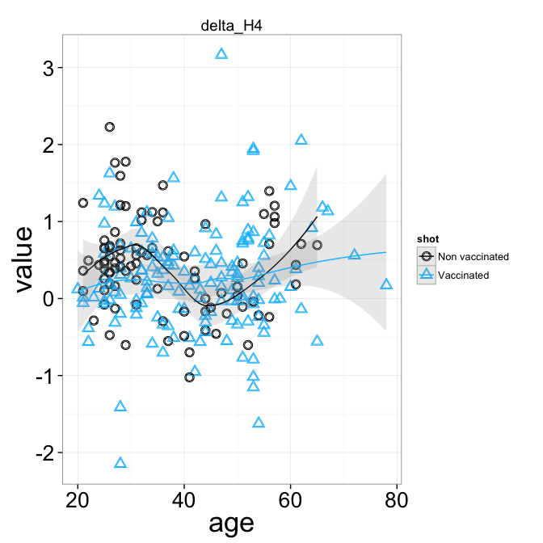

  
Regression of antibody titer vs. age
------------------------------------

<a id="rlm_fit"></a>
## Analysis of antibody titer: robust linear regression
In the following, we fit a robust linear model to the relation:
antibody-titer vs. age. Lots of plots.

### IC50

```
## [1] "Fit on the non vaccinated"
## 
## Call:
## glm(formula = value ~ age, data = melted, subset = (shot == "Non vaccinated"))
## 
## Deviance Residuals: 
##     Min       1Q   Median       3Q      Max  
## -1.3153  -0.3692  -0.0877   0.2822   1.4518  
## 
## Coefficients:
##             Estimate Std. Error t value Pr(>|t|)    
## (Intercept) 2.324060   0.213431   10.89   <2e-16 ***
## age         0.000519   0.005864    0.09     0.93    
## ---
## Signif. codes:  0 '***' 0.001 '**' 0.01 '*' 0.05 '.' 0.1 ' ' 1 
## 
## (Dispersion parameter for gaussian family taken to be 0.3639)
## 
##     Null deviance: 30.570  on 85  degrees of freedom
## Residual deviance: 30.568  on 84  degrees of freedom
##   (17 observations deleted due to missingness)
## AIC: 161.1
## 
## Number of Fisher Scoring iterations: 2
## 
## [1] "Fit on the vaccinated"
## 
## Call:
## glm(formula = value ~ age, data = melted, subset = (shot == "Vaccinated"))
## 
## Deviance Residuals: 
##     Min       1Q   Median       3Q      Max  
## -1.5504  -0.5075  -0.0727   0.4999   1.6812  
## 
## Coefficients:
##             Estimate Std. Error t value Pr(>|t|)    
## (Intercept)  3.29882    0.19158   17.22   <2e-16 ***
## age         -0.01000    0.00443   -2.26    0.025 *  
## ---
## Signif. codes:  0 '***' 0.001 '**' 0.01 '*' 0.05 '.' 0.1 ' ' 1 
## 
## (Dispersion parameter for gaussian family taken to be 0.4492)
## 
##     Null deviance: 73.708  on 160  degrees of freedom
## Residual deviance: 71.415  on 159  degrees of freedom
##   (7 observations deleted due to missingness)
## AIC: 332
## 
## Number of Fisher Scoring iterations: 2
```

 

```
## pdf 
##   2
```

```
## [1] "Fit on the non vaccinated"
## 
## Call:
## glm(formula = value ~ age, data = melted, subset = (shot == "Non vaccinated"))
## 
## Deviance Residuals: 
##     Min       1Q   Median       3Q      Max  
## -1.0395  -0.1996  -0.0142   0.3123   0.7417  
## 
## Coefficients:
##             Estimate Std. Error t value Pr(>|t|)    
## (Intercept)  2.85961    0.12925   22.12   <2e-16 ***
## age          0.00183    0.00350    0.52      0.6    
## ---
## Signif. codes:  0 '***' 0.001 '**' 0.01 '*' 0.05 '.' 0.1 ' ' 1 
## 
## (Dispersion parameter for gaussian family taken to be 0.1454)
## 
##     Null deviance: 13.273  on 92  degrees of freedom
## Residual deviance: 13.234  on 91  degrees of freedom
##   (10 observations deleted due to missingness)
## AIC: 88.59
## 
## Number of Fisher Scoring iterations: 2
## 
## [1] "Fit on the vaccinated"
## 
## Call:
## glm(formula = value ~ age, data = melted, subset = (shot == "Vaccinated"))
## 
## Deviance Residuals: 
##     Min       1Q   Median       3Q      Max  
## -1.1665  -0.3214  -0.0143   0.2311   1.4356  
## 
## Coefficients:
##             Estimate Std. Error t value Pr(>|t|)    
## (Intercept)  2.87275    0.11927   24.09   <2e-16 ***
## age          0.00636    0.00275    2.31    0.022 *  
## ---
## Signif. codes:  0 '***' 0.001 '**' 0.01 '*' 0.05 '.' 0.1 ' ' 1 
## 
## (Dispersion parameter for gaussian family taken to be 0.1809)
## 
##     Null deviance: 30.264  on 163  degrees of freedom
## Residual deviance: 29.300  on 162  degrees of freedom
##   (4 observations deleted due to missingness)
## AIC: 189
## 
## Number of Fisher Scoring iterations: 2
```

 

```
## pdf 
##   2
```

```
## [1] "Fit on the non vaccinated"
## 
## Call:
## glm(formula = value ~ age, data = melted, subset = (shot == "Non vaccinated"))
## 
## Deviance Residuals: 
##     Min       1Q   Median       3Q      Max  
## -0.9166  -0.1728  -0.0104   0.1740   0.8543  
## 
## Coefficients:
##             Estimate Std. Error t value Pr(>|t|)    
## (Intercept)  1.83350    0.09479   19.34  < 2e-16 ***
## age          0.01905    0.00254    7.51  2.7e-11 ***
## ---
## Signif. codes:  0 '***' 0.001 '**' 0.01 '*' 0.05 '.' 0.1 ' ' 1 
## 
## (Dispersion parameter for gaussian family taken to be 0.08503)
## 
##     Null deviance: 13.1304  on 99  degrees of freedom
## Residual deviance:  8.3325  on 98  degrees of freedom
##   (3 observations deleted due to missingness)
## AIC: 41.29
## 
## Number of Fisher Scoring iterations: 2
## 
## [1] "Fit on the vaccinated"
## 
## Call:
## glm(formula = value ~ age, data = melted, subset = (shot == "Vaccinated"))
## 
## Deviance Residuals: 
##     Min       1Q   Median       3Q      Max  
## -1.2207  -0.2494   0.0004   0.2249   0.9413  
## 
## Coefficients:
##             Estimate Std. Error t value Pr(>|t|)    
## (Intercept)  1.28363    0.11523    11.1   <2e-16 ***
## age          0.03092    0.00265    11.7   <2e-16 ***
## ---
## Signif. codes:  0 '***' 0.001 '**' 0.01 '*' 0.05 '.' 0.1 ' ' 1 
## 
## (Dispersion parameter for gaussian family taken to be 0.1694)
## 
##     Null deviance: 50.389  on 162  degrees of freedom
## Residual deviance: 27.274  on 161  degrees of freedom
##   (5 observations deleted due to missingness)
## AIC: 177.2
## 
## Number of Fisher Scoring iterations: 2
```

 

```
## pdf 
##   2
```

```
## [1] "Fit on the non vaccinated"
## 
## Call:
## glm(formula = value ~ age, data = melted, subset = (shot == "Non vaccinated"))
## 
## Deviance Residuals: 
##     Min       1Q   Median       3Q      Max  
## -2.3104  -0.3688  -0.0187   0.4030   1.5889  
## 
## Coefficients:
##             Estimate Std. Error t value Pr(>|t|)    
## (Intercept)  2.62674    0.22556   11.65   <2e-16 ***
## age         -0.00433    0.00608   -0.71     0.48    
## ---
## Signif. codes:  0 '***' 0.001 '**' 0.01 '*' 0.05 '.' 0.1 ' ' 1 
## 
## (Dispersion parameter for gaussian family taken to be 0.461)
## 
##     Null deviance: 41.722  on 91  degrees of freedom
## Residual deviance: 41.488  on 90  degrees of freedom
##   (11 observations deleted due to missingness)
## AIC: 193.8
## 
## Number of Fisher Scoring iterations: 2
## 
## [1] "Fit on the vaccinated"
## 
## Call:
## glm(formula = value ~ age, data = melted, subset = (shot == "Vaccinated"))
## 
## Deviance Residuals: 
##     Min       1Q   Median       3Q      Max  
## -2.1581  -0.3812   0.0065   0.3704   1.2938  
## 
## Coefficients:
##             Estimate Std. Error t value Pr(>|t|)    
## (Intercept)  2.61662    0.16756   15.62   <2e-16 ***
## age          0.00239    0.00390    0.61     0.54    
## ---
## Signif. codes:  0 '***' 0.001 '**' 0.01 '*' 0.05 '.' 0.1 ' ' 1 
## 
## (Dispersion parameter for gaussian family taken to be 0.3494)
## 
##     Null deviance: 54.638  on 157  degrees of freedom
## Residual deviance: 54.506  on 156  degrees of freedom
##   (10 observations deleted due to missingness)
## AIC: 286.2
## 
## Number of Fisher Scoring iterations: 2
```

 

```
## pdf 
##   2
```

```
## [1] "Fit on the non vaccinated"
## 
## Call:
## glm(formula = value ~ age, data = melted, subset = (shot == "Non vaccinated"))
## 
## Deviance Residuals: 
##     Min       1Q   Median       3Q      Max  
## -1.0199  -0.2890  -0.0415   0.2066   0.9165  
## 
## Coefficients:
##             Estimate Std. Error t value Pr(>|t|)    
## (Intercept)  1.64297    0.14286   11.50  < 2e-16 ***
## age          0.02747    0.00381    7.22  1.2e-10 ***
## ---
## Signif. codes:  0 '***' 0.001 '**' 0.01 '*' 0.05 '.' 0.1 ' ' 1 
## 
## (Dispersion parameter for gaussian family taken to be 0.1907)
## 
##     Null deviance: 28.239  on 97  degrees of freedom
## Residual deviance: 18.308  on 96  degrees of freedom
##   (5 observations deleted due to missingness)
## AIC: 119.7
## 
## Number of Fisher Scoring iterations: 2
## 
## [1] "Fit on the vaccinated"
## 
## Call:
## glm(formula = value ~ age, data = melted, subset = (shot == "Vaccinated"))
## 
## Deviance Residuals: 
##     Min       1Q   Median       3Q      Max  
## -1.3714  -0.3451  -0.0295   0.3551   1.0860  
## 
## Coefficients:
##             Estimate Std. Error t value Pr(>|t|)    
## (Intercept)  1.63454    0.13611   12.01  < 2e-16 ***
## age          0.02750    0.00313    8.78  2.2e-15 ***
## ---
## Signif. codes:  0 '***' 0.001 '**' 0.01 '*' 0.05 '.' 0.1 ' ' 1 
## 
## (Dispersion parameter for gaussian family taken to be 0.2386)
## 
##     Null deviance: 57.06  on 163  degrees of freedom
## Residual deviance: 38.65  on 162  degrees of freedom
##   (4 observations deleted due to missingness)
## AIC: 234.4
## 
## Number of Fisher Scoring iterations: 2
```

 

```
## pdf 
##   2
```

```
## [1] "Fit on the non vaccinated"
## 
## Call:
## glm(formula = value ~ age, data = melted, subset = (shot == "Non vaccinated"))
## 
## Deviance Residuals: 
##     Min       1Q   Median       3Q      Max  
## -0.9017  -0.0594   0.0143   0.1637   0.5863  
## 
## Coefficients:
##             Estimate Std. Error t value Pr(>|t|)    
## (Intercept)  1.99637    0.08653   23.07   <2e-16 ***
## age         -0.00146    0.00229   -0.64     0.52    
## ---
## Signif. codes:  0 '***' 0.001 '**' 0.01 '*' 0.05 '.' 0.1 ' ' 1 
## 
## (Dispersion parameter for gaussian family taken to be 0.06363)
## 
##     Null deviance: 5.625  on 89  degrees of freedom
## Residual deviance: 5.599  on 88  degrees of freedom
##   (13 observations deleted due to missingness)
## AIC: 11.46
## 
## Number of Fisher Scoring iterations: 2
## 
## [1] "Fit on the vaccinated"
## 
## Call:
## glm(formula = value ~ age, data = melted, subset = (shot == "Vaccinated"))
## 
## Deviance Residuals: 
##     Min       1Q   Median       3Q      Max  
## -0.6798  -0.1293  -0.0283   0.1116   1.5030  
## 
## Coefficients:
##             Estimate Std. Error t value Pr(>|t|)    
## (Intercept)  1.92830    0.08785    21.9   <2e-16 ***
## age          0.00121    0.00201     0.6     0.55    
## ---
## Signif. codes:  0 '***' 0.001 '**' 0.01 '*' 0.05 '.' 0.1 ' ' 1 
## 
## (Dispersion parameter for gaussian family taken to be 0.09045)
## 
##     Null deviance: 13.782  on 153  degrees of freedom
## Residual deviance: 13.749  on 152  degrees of freedom
##   (14 observations deleted due to missingness)
## AIC: 70.97
## 
## Number of Fisher Scoring iterations: 2
```

 

```
## pdf 
##   2
```

```
## [1] "Fit on the non vaccinated"
## 
## Call:
## glm(formula = value ~ age, data = melted, subset = (shot == "Non vaccinated"))
## 
## Deviance Residuals: 
##    Min      1Q  Median      3Q     Max  
## -17.46   -2.96    0.14    3.34   51.18  
## 
## Coefficients:
##             Estimate Std. Error t value Pr(>|t|)
## (Intercept)  -0.3528     2.7085   -0.13     0.90
## age           0.0487     0.0731    0.67     0.51
## 
## (Dispersion parameter for gaussian family taken to be 72.49)
## 
##     Null deviance: 7353.6  on 102  degrees of freedom
## Residual deviance: 7321.4  on 101  degrees of freedom
## AIC: 737.5
## 
## Number of Fisher Scoring iterations: 2
## 
## [1] "Fit on the vaccinated"
## 
## Call:
## glm(formula = value ~ age, data = melted, subset = (shot == "Vaccinated"))
## 
## Deviance Residuals: 
##    Min      1Q  Median      3Q     Max  
## -21.45   -4.96   -1.95    2.17   69.10  
## 
## Coefficients:
##             Estimate Std. Error t value Pr(>|t|)
## (Intercept)  4.80663    3.26470    1.47     0.14
## age          0.00437    0.07546    0.06     0.95
## 
## (Dispersion parameter for gaussian family taken to be 140.2)
## 
##     Null deviance: 23274  on 167  degrees of freedom
## Residual deviance: 23274  on 166  degrees of freedom
## AIC: 1311
## 
## Number of Fisher Scoring iterations: 2
```

 

```
## pdf 
##   2
```

```
## [1] "Fit on the non vaccinated"
## 
## Call:
## glm(formula = value ~ age, data = melted, subset = (shot == "Non vaccinated"))
## 
## Deviance Residuals: 
##    Min      1Q  Median      3Q     Max  
## -20.77   -8.15   -2.11    7.28   29.83  
## 
## Coefficients:
##             Estimate Std. Error t value Pr(>|t|)    
## (Intercept)  13.4257     3.6418    3.69  0.00037 ***
## age           0.0285     0.0982    0.29  0.77193    
## ---
## Signif. codes:  0 '***' 0.001 '**' 0.01 '*' 0.05 '.' 0.1 ' ' 1 
## 
## (Dispersion parameter for gaussian family taken to be 131.1)
## 
##     Null deviance: 13248  on 102  degrees of freedom
## Residual deviance: 13237  on 101  degrees of freedom
## AIC: 798.5
## 
## Number of Fisher Scoring iterations: 2
## 
## [1] "Fit on the vaccinated"
## 
## Call:
## glm(formula = value ~ age, data = melted, subset = (shot == "Vaccinated"))
## 
## Deviance Residuals: 
##    Min      1Q  Median      3Q     Max  
## -21.58   -9.83   -1.78    7.95   43.18  
## 
## Coefficients:
##             Estimate Std. Error t value Pr(>|t|)  
## (Intercept)   6.6675     3.4462    1.93    0.055 .
## age           0.1730     0.0797    2.17    0.031 *
## ---
## Signif. codes:  0 '***' 0.001 '**' 0.01 '*' 0.05 '.' 0.1 ' ' 1 
## 
## (Dispersion parameter for gaussian family taken to be 156.2)
## 
##     Null deviance: 26669  on 167  degrees of freedom
## Residual deviance: 25933  on 166  degrees of freedom
## AIC: 1329
## 
## Number of Fisher Scoring iterations: 2
```

 

```
## pdf 
##   2
```


----

### EC50

```
## [1] "Fit on the non vaccinated"
## 
## Call:
## glm(formula = value ~ age, data = melted, subset = (shot == "Non vaccinated"))
## 
## Deviance Residuals: 
##     Min       1Q   Median       3Q      Max  
## -0.7154  -0.1894   0.0074   0.1568   0.7970  
## 
## Coefficients:
##             Estimate Std. Error t value Pr(>|t|)    
## (Intercept)  1.30591    0.10733   12.17   <2e-16 ***
## age          0.00158    0.00289    0.55     0.59    
## ---
## Signif. codes:  0 '***' 0.001 '**' 0.01 '*' 0.05 '.' 0.1 ' ' 1 
## 
## (Dispersion parameter for gaussian family taken to be 0.1119)
## 
##     Null deviance: 11.223  on 101  degrees of freedom
## Residual deviance: 11.189  on 100  degrees of freedom
##   (1 observation deleted due to missingness)
## AIC: 70.04
## 
## Number of Fisher Scoring iterations: 2
## 
## [1] "Fit on the vaccinated"
## 
## Call:
## glm(formula = value ~ age, data = melted, subset = (shot == "Vaccinated"))
## 
## Deviance Residuals: 
##     Min       1Q   Median       3Q      Max  
## -0.6581  -0.2210  -0.0095   0.2005   0.7944  
## 
## Coefficients:
##             Estimate Std. Error t value Pr(>|t|)    
## (Intercept)  1.30462    0.08280   15.76  < 2e-16 ***
## age          0.00643    0.00191    3.36  0.00097 ***
## ---
## Signif. codes:  0 '***' 0.001 '**' 0.01 '*' 0.05 '.' 0.1 ' ' 1 
## 
## (Dispersion parameter for gaussian family taken to be 0.09019)
## 
##     Null deviance: 15.989  on 167  degrees of freedom
## Residual deviance: 14.971  on 166  degrees of freedom
## AIC: 76.56
## 
## Number of Fisher Scoring iterations: 2
```

 

```
## pdf 
##   2
```

```
## [1] "Fit on the non vaccinated"
## 
## Call:
## glm(formula = value ~ age, data = melted, subset = (shot == "Non vaccinated"))
## 
## Deviance Residuals: 
##     Min       1Q   Median       3Q      Max  
## -0.9319  -0.2240   0.0315   0.2021   1.0795  
## 
## Coefficients:
##             Estimate Std. Error t value Pr(>|t|)    
## (Intercept)  1.78146    0.11363   15.68   <2e-16 ***
## age          0.00854    0.00306    2.79   0.0064 ** 
## ---
## Signif. codes:  0 '***' 0.001 '**' 0.01 '*' 0.05 '.' 0.1 ' ' 1 
## 
## (Dispersion parameter for gaussian family taken to be 0.1276)
## 
##     Null deviance: 13.878  on 102  degrees of freedom
## Residual deviance: 12.887  on 101  degrees of freedom
## AIC: 84.21
## 
## Number of Fisher Scoring iterations: 2
## 
## [1] "Fit on the vaccinated"
## 
## Call:
## glm(formula = value ~ age, data = melted, subset = (shot == "Vaccinated"))
## 
## Deviance Residuals: 
##     Min       1Q   Median       3Q      Max  
## -0.9077  -0.1988  -0.0012   0.1829   0.7736  
## 
## Coefficients:
##             Estimate Std. Error t value Pr(>|t|)    
## (Intercept)  2.14164    0.08398   25.50   <2e-16 ***
## age          0.00785    0.00194    4.04    8e-05 ***
## ---
## Signif. codes:  0 '***' 0.001 '**' 0.01 '*' 0.05 '.' 0.1 ' ' 1 
## 
## (Dispersion parameter for gaussian family taken to be 0.09278)
## 
##     Null deviance: 16.919  on 167  degrees of freedom
## Residual deviance: 15.402  on 166  degrees of freedom
## AIC: 81.33
## 
## Number of Fisher Scoring iterations: 2
```

 

```
## pdf 
##   2
```

```
## [1] "Fit on the non vaccinated"
## 
## Call:
## glm(formula = value ~ age, data = melted, subset = (shot == "Non vaccinated"))
## 
## Deviance Residuals: 
##     Min       1Q   Median       3Q      Max  
## -1.8223  -0.3035  -0.0013   0.3128   1.1170  
## 
## Coefficients:
##             Estimate Std. Error t value Pr(>|t|)    
## (Intercept)  0.19520    0.16433    1.19     0.24    
## age          0.02253    0.00441    5.11  1.6e-06 ***
## ---
## Signif. codes:  0 '***' 0.001 '**' 0.01 '*' 0.05 '.' 0.1 ' ' 1 
## 
## (Dispersion parameter for gaussian family taken to be 0.2605)
## 
##     Null deviance: 32.587  on 100  degrees of freedom
## Residual deviance: 25.787  on  99  degrees of freedom
##   (2 observations deleted due to missingness)
## AIC: 154.7
## 
## Number of Fisher Scoring iterations: 2
## 
## [1] "Fit on the vaccinated"
## 
## Call:
## glm(formula = value ~ age, data = melted, subset = (shot == "Vaccinated"))
## 
## Deviance Residuals: 
##     Min       1Q   Median       3Q      Max  
## -1.8675  -0.2746  -0.0132   0.3120   1.6909  
## 
## Coefficients:
##             Estimate Std. Error t value Pr(>|t|)    
## (Intercept) -0.29617    0.14410   -2.06    0.041 *  
## age          0.03608    0.00333   10.83   <2e-16 ***
## ---
## Signif. codes:  0 '***' 0.001 '**' 0.01 '*' 0.05 '.' 0.1 ' ' 1 
## 
## (Dispersion parameter for gaussian family taken to be 0.2731)
## 
##     Null deviance: 77.081  on 166  degrees of freedom
## Residual deviance: 45.064  on 165  degrees of freedom
##   (1 observation deleted due to missingness)
## AIC: 261.2
## 
## Number of Fisher Scoring iterations: 2
```

 

```
## pdf 
##   2
```

```
## [1] "Fit on the non vaccinated"
## 
## Call:
## glm(formula = value ~ age, data = melted, subset = (shot == "Non vaccinated"))
## 
## Deviance Residuals: 
##     Min       1Q   Median       3Q      Max  
## -1.0459  -0.3308  -0.0491   0.2972   1.3554  
## 
## Coefficients:
##             Estimate Std. Error t value Pr(>|t|)    
## (Intercept)  3.76899    0.15390   24.49  < 2e-16 ***
## age         -0.01492    0.00415   -3.59  0.00051 ***
## ---
## Signif. codes:  0 '***' 0.001 '**' 0.01 '*' 0.05 '.' 0.1 ' ' 1 
## 
## (Dispersion parameter for gaussian family taken to be 0.234)
## 
##     Null deviance: 26.660  on 102  degrees of freedom
## Residual deviance: 23.638  on 101  degrees of freedom
## AIC: 146.7
## 
## Number of Fisher Scoring iterations: 2
## 
## [1] "Fit on the vaccinated"
## 
## Call:
## glm(formula = value ~ age, data = melted, subset = (shot == "Vaccinated"))
## 
## Deviance Residuals: 
##     Min       1Q   Median       3Q      Max  
## -1.2203  -0.3096  -0.0271   0.3057   1.2901  
## 
## Coefficients:
##             Estimate Std. Error t value Pr(>|t|)    
## (Intercept)  3.67397    0.13196   27.84   <2e-16 ***
## age         -0.00673    0.00305   -2.21    0.029 *  
## ---
## Signif. codes:  0 '***' 0.001 '**' 0.01 '*' 0.05 '.' 0.1 ' ' 1 
## 
## (Dispersion parameter for gaussian family taken to be 0.2291)
## 
##     Null deviance: 39.140  on 167  degrees of freedom
## Residual deviance: 38.024  on 166  degrees of freedom
## AIC: 233.2
## 
## Number of Fisher Scoring iterations: 2
```

 

```
## pdf 
##   2
```

```
## [1] "Fit on the non vaccinated"
## 
## Call:
## glm(formula = value ~ age, data = melted, subset = (shot == "Non vaccinated"))
## 
## Deviance Residuals: 
##     Min       1Q   Median       3Q      Max  
## -1.8384  -0.3353   0.0242   0.3513   1.4259  
## 
## Coefficients:
##             Estimate Std. Error t value Pr(>|t|)    
## (Intercept)  1.28820    0.20166    6.39  5.4e-09 ***
## age          0.00636    0.00543    1.17     0.24    
## ---
## Signif. codes:  0 '***' 0.001 '**' 0.01 '*' 0.05 '.' 0.1 ' ' 1 
## 
## (Dispersion parameter for gaussian family taken to be 0.3986)
## 
##     Null deviance: 40.409  on 101  degrees of freedom
## Residual deviance: 39.861  on 100  degrees of freedom
##   (1 observation deleted due to missingness)
## AIC: 199.6
## 
## Number of Fisher Scoring iterations: 2
## 
## [1] "Fit on the vaccinated"
## 
## Call:
## glm(formula = value ~ age, data = melted, subset = (shot == "Vaccinated"))
## 
## Deviance Residuals: 
##     Min       1Q   Median       3Q      Max  
## -2.4651  -0.2953   0.0636   0.2884   2.4023  
## 
## Coefficients:
##             Estimate Std. Error t value Pr(>|t|)    
## (Intercept)  1.59274    0.19216    8.29  4.3e-14 ***
## age          0.00139    0.00443    0.31     0.75    
## ---
## Signif. codes:  0 '***' 0.001 '**' 0.01 '*' 0.05 '.' 0.1 ' ' 1 
## 
## (Dispersion parameter for gaussian family taken to be 0.4736)
## 
##     Null deviance: 76.291  on 162  degrees of freedom
## Residual deviance: 76.244  on 161  degrees of freedom
##   (5 observations deleted due to missingness)
## AIC: 344.7
## 
## Number of Fisher Scoring iterations: 2
```

 

```
## pdf 
##   2
```

```
## [1] "Fit on the non vaccinated"
## 
## Call:
## glm(formula = value ~ age, data = melted, subset = (shot == "Non vaccinated"))
## 
## Deviance Residuals: 
##     Min       1Q   Median       3Q      Max  
## -1.2255  -0.2625  -0.0052   0.2430   1.1616  
## 
## Coefficients:
##             Estimate Std. Error t value Pr(>|t|)    
## (Intercept)  1.07372    0.14351    7.48  2.8e-11 ***
## age          0.00921    0.00387    2.38    0.019 *  
## ---
## Signif. codes:  0 '***' 0.001 '**' 0.01 '*' 0.05 '.' 0.1 ' ' 1 
## 
## (Dispersion parameter for gaussian family taken to be 0.2035)
## 
##     Null deviance: 21.707  on 102  degrees of freedom
## Residual deviance: 20.555  on 101  degrees of freedom
## AIC: 132.3
## 
## Number of Fisher Scoring iterations: 2
## 
## [1] "Fit on the vaccinated"
## 
## Call:
## glm(formula = value ~ age, data = melted, subset = (shot == "Vaccinated"))
## 
## Deviance Residuals: 
##     Min       1Q   Median       3Q      Max  
## -1.2335  -0.3673  -0.0327   0.2890   1.3736  
## 
## Coefficients:
##             Estimate Std. Error t value Pr(>|t|)    
## (Intercept)  1.11220    0.13742    8.09  1.2e-13 ***
## age          0.01539    0.00318    4.85  2.9e-06 ***
## ---
## Signif. codes:  0 '***' 0.001 '**' 0.01 '*' 0.05 '.' 0.1 ' ' 1 
## 
## (Dispersion parameter for gaussian family taken to be 0.2484)
## 
##     Null deviance: 47.068  on 167  degrees of freedom
## Residual deviance: 41.236  on 166  degrees of freedom
## AIC: 246.8
## 
## Number of Fisher Scoring iterations: 2
```

 

```
## pdf 
##   2
```

```
## [1] "Fit on the non vaccinated"
## 
## Call:
## glm(formula = value ~ age, data = melted, subset = (shot == "Non vaccinated"))
## 
## Deviance Residuals: 
##     Min       1Q   Median       3Q      Max  
## -1.1667  -0.1689   0.0435   0.2046   0.5875  
## 
## Coefficients:
##             Estimate Std. Error t value Pr(>|t|)    
## (Intercept)  1.26761    0.09872   12.84   <2e-16 ***
## age          0.00148    0.00266    0.55     0.58    
## ---
## Signif. codes:  0 '***' 0.001 '**' 0.01 '*' 0.05 '.' 0.1 ' ' 1 
## 
## (Dispersion parameter for gaussian family taken to be 0.0963)
## 
##     Null deviance: 9.7556  on 102  degrees of freedom
## Residual deviance: 9.7260  on 101  degrees of freedom
## AIC: 55.23
## 
## Number of Fisher Scoring iterations: 2
## 
## [1] "Fit on the vaccinated"
## 
## Call:
## glm(formula = value ~ age, data = melted, subset = (shot == "Vaccinated"))
## 
## Deviance Residuals: 
##     Min       1Q   Median       3Q      Max  
## -0.7271  -0.1516  -0.0027   0.1635   0.5679  
## 
## Coefficients:
##             Estimate Std. Error t value Pr(>|t|)    
## (Intercept)  1.20868    0.06892   17.54   <2e-16 ***
## age          0.00097    0.00159    0.61     0.54    
## ---
## Signif. codes:  0 '***' 0.001 '**' 0.01 '*' 0.05 '.' 0.1 ' ' 1 
## 
## (Dispersion parameter for gaussian family taken to be 0.06248)
## 
##     Null deviance: 10.394  on 167  degrees of freedom
## Residual deviance: 10.371  on 166  degrees of freedom
## AIC: 14.89
## 
## Number of Fisher Scoring iterations: 2
```

 

```
## pdf 
##   2
```

```
## [1] "Fit on the non vaccinated"
## 
## Call:
## glm(formula = value ~ age, data = melted, subset = (shot == "Non vaccinated"))
## 
## Deviance Residuals: 
##     Min       1Q   Median       3Q      Max  
## -1.5138  -0.1574   0.0159   0.1793   0.7812  
## 
## Coefficients:
##             Estimate Std. Error t value Pr(>|t|)    
## (Intercept)  1.78291    0.09564   18.64   <2e-16 ***
## age         -0.00379    0.00258   -1.47     0.14    
## ---
## Signif. codes:  0 '***' 0.001 '**' 0.01 '*' 0.05 '.' 0.1 ' ' 1 
## 
## (Dispersion parameter for gaussian family taken to be 0.09039)
## 
##     Null deviance: 9.3248  on 102  degrees of freedom
## Residual deviance: 9.1296  on 101  degrees of freedom
## AIC: 48.71
## 
## Number of Fisher Scoring iterations: 2
## 
## [1] "Fit on the vaccinated"
## 
## Call:
## glm(formula = value ~ age, data = melted, subset = (shot == "Vaccinated"))
## 
## Deviance Residuals: 
##     Min       1Q   Median       3Q      Max  
## -0.8782  -0.1996  -0.0136   0.1835   1.0110  
## 
## Coefficients:
##             Estimate Std. Error t value Pr(>|t|)    
## (Intercept)  1.77300    0.07371   24.05   <2e-16 ***
## age         -0.00347    0.00170   -2.04    0.043 *  
## ---
## Signif. codes:  0 '***' 0.001 '**' 0.01 '*' 0.05 '.' 0.1 ' ' 1 
## 
## (Dispersion parameter for gaussian family taken to be 0.07147)
## 
##     Null deviance: 12.161  on 167  degrees of freedom
## Residual deviance: 11.864  on 166  degrees of freedom
## AIC: 37.48
## 
## Number of Fisher Scoring iterations: 2
```

 

```
## pdf 
##   2
```

```
## [1] "Fit on the non vaccinated"
## 
## Call:
## glm(formula = value ~ age, data = melted, subset = (shot == "Non vaccinated"))
## 
## Deviance Residuals: 
##     Min       1Q   Median       3Q      Max  
## -1.0535  -0.2873  -0.0308   0.2394   1.1135  
## 
## Coefficients:
##             Estimate Std. Error t value Pr(>|t|)    
## (Intercept)  2.50812    0.13227   18.96   <2e-16 ***
## age         -0.00933    0.00357   -2.62     0.01 *  
## ---
## Signif. codes:  0 '***' 0.001 '**' 0.01 '*' 0.05 '.' 0.1 ' ' 1 
## 
## (Dispersion parameter for gaussian family taken to be 0.1729)
## 
##     Null deviance: 18.644  on 102  degrees of freedom
## Residual deviance: 17.461  on 101  degrees of freedom
## AIC: 115.5
## 
## Number of Fisher Scoring iterations: 2
## 
## [1] "Fit on the vaccinated"
## 
## Call:
## glm(formula = value ~ age, data = melted, subset = (shot == "Vaccinated"))
## 
## Deviance Residuals: 
##     Min       1Q   Median       3Q      Max  
## -0.8714  -0.3762  -0.0471   0.2922   1.5016  
## 
## Coefficients:
##             Estimate Std. Error t value Pr(>|t|)    
## (Intercept)  2.40231    0.13262   18.11   <2e-16 ***
## age         -0.00302    0.00307   -0.99     0.33    
## ---
## Signif. codes:  0 '***' 0.001 '**' 0.01 '*' 0.05 '.' 0.1 ' ' 1 
## 
## (Dispersion parameter for gaussian family taken to be 0.2314)
## 
##     Null deviance: 38.629  on 167  degrees of freedom
## Residual deviance: 38.405  on 166  degrees of freedom
## AIC: 234.8
## 
## Number of Fisher Scoring iterations: 2
```

 

```
## pdf 
##   2
```


----

### Difference between IC50 and EC50, vs age
Her we plot the IC50 value minus EC50 vs. age and a loess smoothing.
   


## _Latest update: 6 May 2013_.
