Smoothing (aka non-parametric regression)
-----------------------------------------

<a id="smooth_fit"></a>
## Specific analysis of some strains: smoothing
Since the segmented regression gives very erratic results, we try a
non-parametric regression (_i.e._ we perform smoothing).

### IC50
 

```
## pdf 
##   2
```

 

```
## pdf 
##   2
```

 

```
## pdf 
##   2
```

 

```
## pdf 
##   2
```

 

```
## pdf 
##   2
```

 

```
## pdf 
##   2
```

 

```
## pdf 
##   2
```

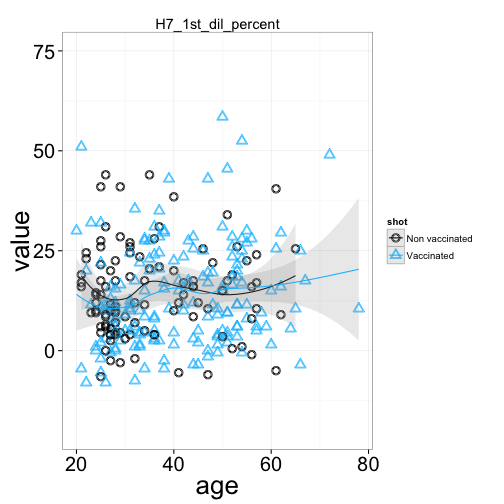 

```
## pdf 
##   2
```


### EC50
 

```
## pdf 
##   2
```

 

```
## pdf 
##   2
```

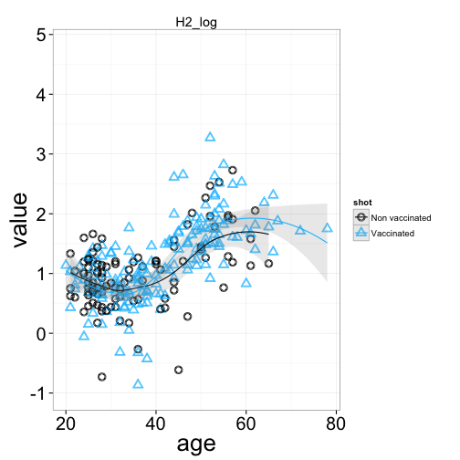 

```
## pdf 
##   2
```

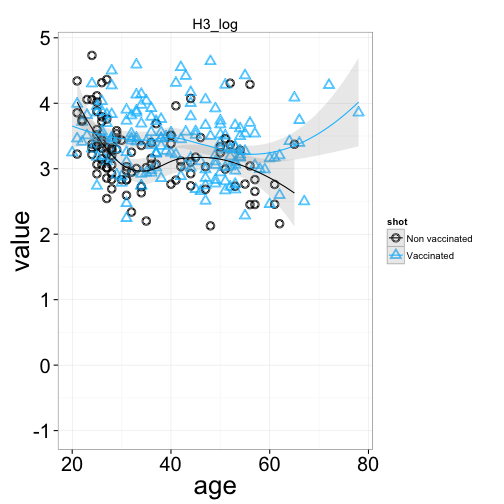 

```
## pdf 
##   2
```

 

```
## pdf 
##   2
```

 

```
## pdf 
##   2
```

 

```
## pdf 
##   2
```

 

```
## pdf 
##   2
```

 

```
## pdf 
##   2
```


### IC50

```
## 
Multistart 1 of 1 |
Multistart 1 of 1 |
Multistart 1 of 1 |
Multistart 1 of 1 /
Multistart 1 of 1 |
Multistart 1 of 1 |
                   
```

 

```
## 
Multistart 1 of 1 |
Multistart 1 of 1 |
Multistart 1 of 1 |
Multistart 1 of 1 /
Multistart 1 of 1 |
Multistart 1 of 1 |
                   
```

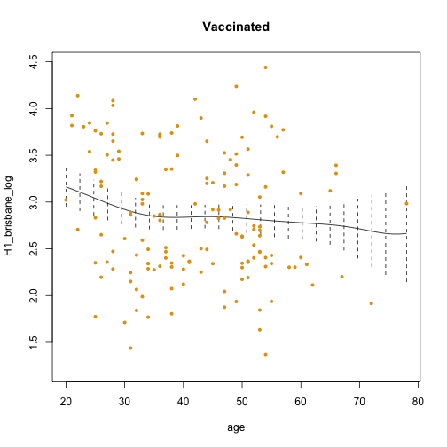 

```
## 
Multistart 1 of 1 |
Multistart 1 of 1 |
Multistart 1 of 1 |
Multistart 1 of 1 /
Multistart 1 of 1 |
Multistart 1 of 1 |
                   
```

 

```
## 
Multistart 1 of 1 |
Multistart 1 of 1 |
Multistart 1 of 1 |
Multistart 1 of 1 /
Multistart 1 of 1 |
Multistart 1 of 1 |
                   
```

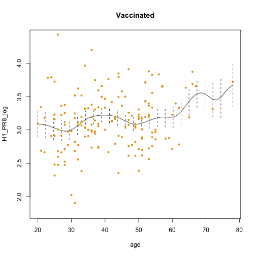 

```
## 
Multistart 1 of 1 |
Multistart 1 of 1 |
Multistart 1 of 1 |
Multistart 1 of 1 /
Multistart 1 of 1 |
Multistart 1 of 1 |
                   
```

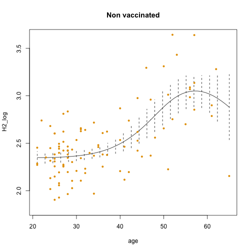 

```
## 
Multistart 1 of 1 |
Multistart 1 of 1 |
Multistart 1 of 1 |
Multistart 1 of 1 /
Multistart 1 of 1 |
Multistart 1 of 1 |
                   
```

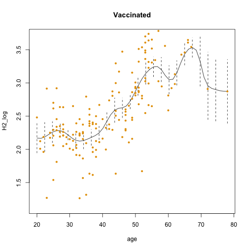 

```
## 
Multistart 1 of 1 |
Multistart 1 of 1 |
Multistart 1 of 1 |
Multistart 1 of 1 /
Multistart 1 of 1 |
Multistart 1 of 1 |
                   
```

 

```
## 
Multistart 1 of 1 |
Multistart 1 of 1 |
Multistart 1 of 1 |
Multistart 1 of 1 /
Multistart 1 of 1 |
Multistart 1 of 1 |
                   
```

 

```
## 
Multistart 1 of 1 |
Multistart 1 of 1 |
Multistart 1 of 1 |
Multistart 1 of 1 /
Multistart 1 of 1 |
Multistart 1 of 1 |
                   
```

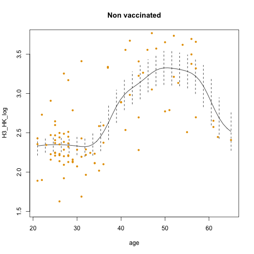 

```
## 
Multistart 1 of 1 |
Multistart 1 of 1 |
Multistart 1 of 1 |
Multistart 1 of 1 /
Multistart 1 of 1 |
Multistart 1 of 1 |
                   
```

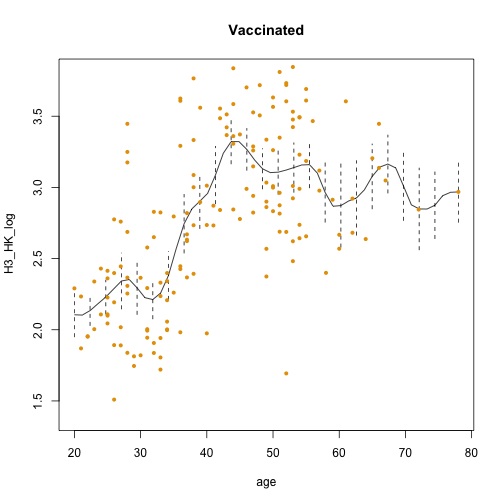 

```
## 
Multistart 1 of 1 |
Multistart 1 of 1 |
Multistart 1 of 1 |
Multistart 1 of 1 /
Multistart 1 of 1 |
Multistart 1 of 1 |
                   
```

 

```
## 
Multistart 1 of 1 |
Multistart 1 of 1 |
Multistart 1 of 1 |
Multistart 1 of 1 /
Multistart 1 of 1 |
Multistart 1 of 1 |
                   
```

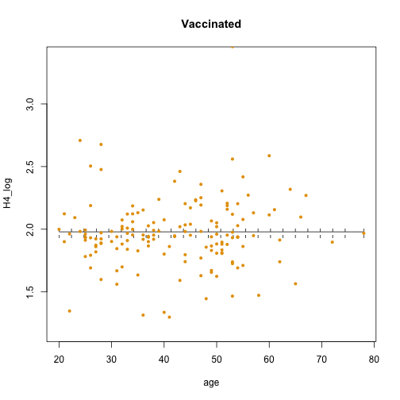 

```
## 
Multistart 1 of 1 |
Multistart 1 of 1 |
Multistart 1 of 1 |
Multistart 1 of 1 /
Multistart 1 of 1 |
Multistart 1 of 1 |
                   
```

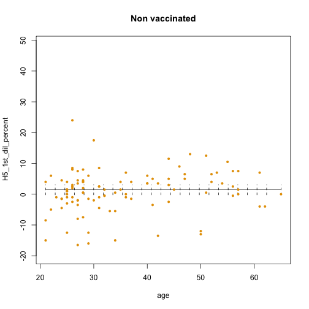 

```
## 
Multistart 1 of 1 |
Multistart 1 of 1 |
Multistart 1 of 1 |
Multistart 1 of 1 /
Multistart 1 of 1 |
Multistart 1 of 1 |
                   
```

 

```
## 
Multistart 1 of 1 |
Multistart 1 of 1 |
Multistart 1 of 1 |
Multistart 1 of 1 /
Multistart 1 of 1 |
Multistart 1 of 1 |
                   
```

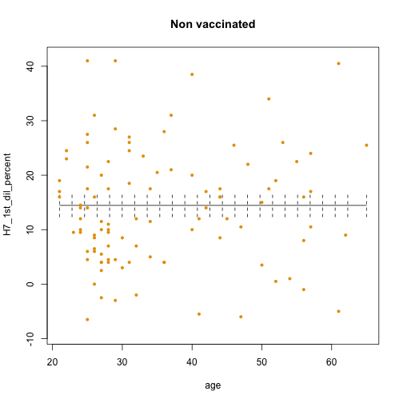 

```
## 
Multistart 1 of 1 |
Multistart 1 of 1 |
Multistart 1 of 1 |
Multistart 1 of 1 /
Multistart 1 of 1 |
Multistart 1 of 1 |
                   
```

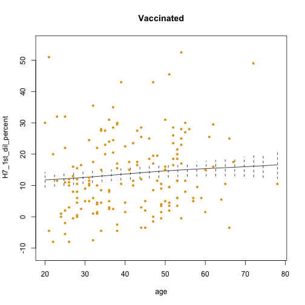 


### EC50

```
## 
Multistart 1 of 1 |
Multistart 1 of 1 |
Multistart 1 of 1 |
Multistart 1 of 1 /
Multistart 1 of 1 |
Multistart 1 of 1 |
                   
```

```
## 
Multistart 1 of 1 |
Multistart 1 of 1 |
Multistart 1 of 1 |
Multistart 1 of 1 /
Multistart 1 of 1 |
Multistart 1 of 1 |
                   
```

```
## 
Multistart 1 of 1 |
Multistart 1 of 1 |
Multistart 1 of 1 |
Multistart 1 of 1 /
Multistart 1 of 1 |
Multistart 1 of 1 |
                   
```

```
## 
Multistart 1 of 1 |
Multistart 1 of 1 |
Multistart 1 of 1 |
Multistart 1 of 1 /
Multistart 1 of 1 |
Multistart 1 of 1 |
                   
```

```
## 
Multistart 1 of 1 |
Multistart 1 of 1 |
Multistart 1 of 1 |
Multistart 1 of 1 /
Multistart 1 of 1 |
Multistart 1 of 1 |
                   
```

```
## 
Multistart 1 of 1 |
Multistart 1 of 1 |
Multistart 1 of 1 |
Multistart 1 of 1 /
Multistart 1 of 1 |
Multistart 1 of 1 |
                   
```

```
## 
Multistart 1 of 1 |
Multistart 1 of 1 |
Multistart 1 of 1 |
Multistart 1 of 1 /
Multistart 1 of 1 |
Multistart 1 of 1 |
                   
```

```
## 
Multistart 1 of 1 |
Multistart 1 of 1 |
Multistart 1 of 1 |
Multistart 1 of 1 /
Multistart 1 of 1 |
Multistart 1 of 1 |
                   
```

```
## 
Multistart 1 of 1 |
Multistart 1 of 1 |
Multistart 1 of 1 |
Multistart 1 of 1 /
Multistart 1 of 1 |
Multistart 1 of 1 |
                   
```

```
## 
Multistart 1 of 1 |
Multistart 1 of 1 |
Multistart 1 of 1 |
Multistart 1 of 1 /
Multistart 1 of 1 |
Multistart 1 of 1 |
                   
```

```
## 
Multistart 1 of 1 |
Multistart 1 of 1 |
Multistart 1 of 1 |
Multistart 1 of 1 /
Multistart 1 of 1 |
Multistart 1 of 1 |
                   
```

```
## 
Multistart 1 of 1 |
Multistart 1 of 1 |
Multistart 1 of 1 |
Multistart 1 of 1 /
Multistart 1 of 1 |
Multistart 1 of 1 |
                   
```

```
## 
Multistart 1 of 1 |
Multistart 1 of 1 |
Multistart 1 of 1 |
Multistart 1 of 1 /
Multistart 1 of 1 |
Multistart 1 of 1 |
                   
```

```
## 
Multistart 1 of 1 |
Multistart 1 of 1 |
Multistart 1 of 1 |
Multistart 1 of 1 /
Multistart 1 of 1 |
Multistart 1 of 1 |
                   
```

```
## 
Multistart 1 of 1 |
Multistart 1 of 1 |
Multistart 1 of 1 |
Multistart 1 of 1 /
Multistart 1 of 1 |
Multistart 1 of 1 |
                   
```

```
## 
Multistart 1 of 1 |
Multistart 1 of 1 |
Multistart 1 of 1 |
Multistart 1 of 1 /
Multistart 1 of 1 |
Multistart 1 of 1 |
                   
```

```
## 
Multistart 1 of 1 |
Multistart 1 of 1 |
Multistart 1 of 1 |
Multistart 1 of 1 /
Multistart 1 of 1 |
Multistart 1 of 1 |
                   
```

```
## 
Multistart 1 of 1 |
Multistart 1 of 1 |
Multistart 1 of 1 |
Multistart 1 of 1 /
Multistart 1 of 1 |
Multistart 1 of 1 |
                   
```

 


----

## _Latest update: 19 May 2013_.
