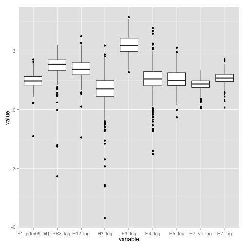
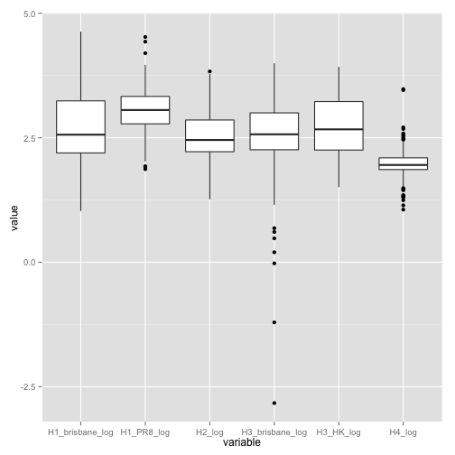
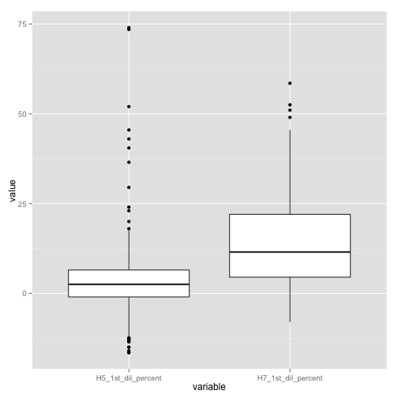
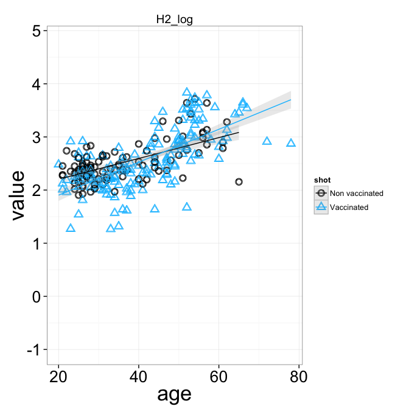
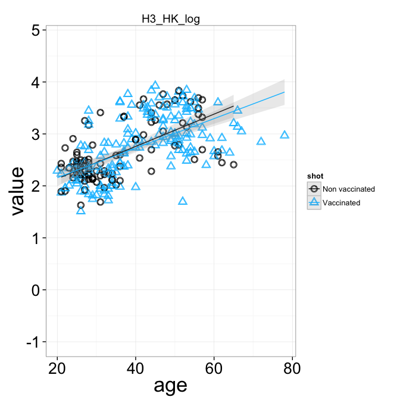
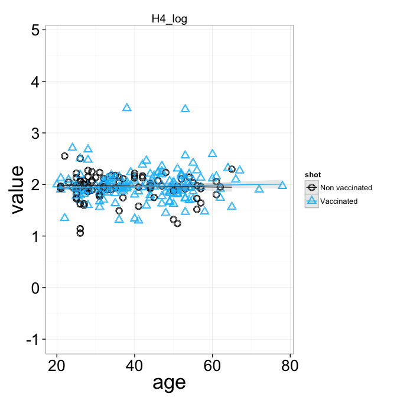
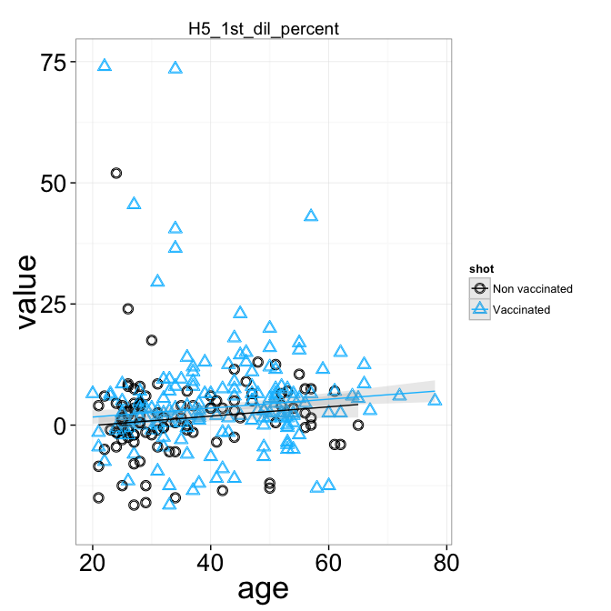
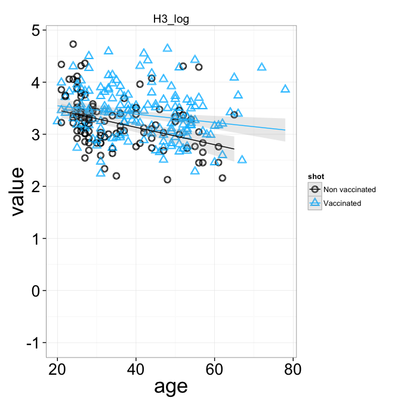
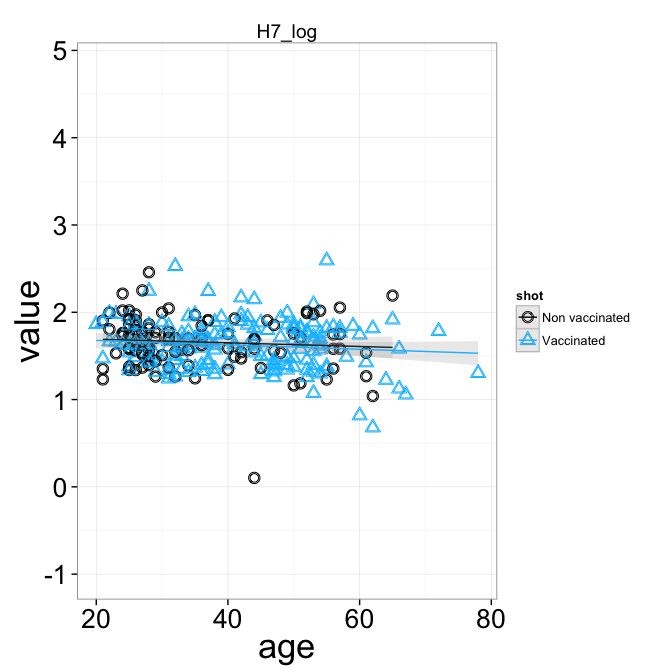

Analysis of antibody titers from a bunch of donors
========================================================
## Data
Data were loaded from several csv files (one per strain) and merged into two
dataframes, one for IC50 values and one for the EC50 values.


## Data cleaning
IC_50 could not be computed for H5 and H7. For these two strains, rather than
the inhibitory concentrations, the inhibition value at the first dilution is
reported, expressed in percentage.

EC50 data present two outliers (one in H2 and one in H4 titers): their value
for effective concentration was lower than -40 (in log scale) and for this
reason were removed.

```r
ec_data$H2_log[ec_data$H2_log < -40] <- NA
ec_data$H4_log[ec_data$H4_log < -40] <- NA
```


The following plots show the distribution of values, one boxplot per strain.
IC50 for H5 and H7 are shown separately because the scale is different
(percentage).

#### IC50
  

#### EC50
 


### Merge with donors data
Donors data were taken from the file `donors_view.csv` in the `data/` directory.
We excluded donors enrolled in the Novartis study, HIV positive and those for
which the number of vaccinations is not defined.


We are left with 271 donors, 141 females and 130 males, for which we can plot
the following characteristics.
 


```
## Error: invalid argument to unary operator
```

 

```
##                 
##                   F  M
##   Non vaccinated 55 48
##   Vaccinated     86 82
```

We show the boxplots again, limited to donors considered here.
#### IC50
  

#### EC50
 


----
## Analysis of antibody titer
In the following, we fit a robust linear model to the relation:
antibody-titer vs. age. Lots of plots.

### IC50


```
## [1] "Fit on the non vaccinated"
## 
## Call:
## glm(formula = value ~ age, data = melted, subset = (shot == "Non vaccinated"))
## 
## Deviance Residuals: 
##     Min       1Q   Median       3Q      Max  
## -1.3153  -0.3692  -0.0877   0.2822   1.4518  
## 
## Coefficients:
##             Estimate Std. Error t value Pr(>|t|)    
## (Intercept) 2.324060   0.213431   10.89   <2e-16 ***
## age         0.000519   0.005864    0.09     0.93    
## ---
## Signif. codes:  0 '***' 0.001 '**' 0.01 '*' 0.05 '.' 0.1 ' ' 1 
## 
## (Dispersion parameter for gaussian family taken to be 0.3639)
## 
##     Null deviance: 30.570  on 85  degrees of freedom
## Residual deviance: 30.568  on 84  degrees of freedom
##   (17 observations deleted due to missingness)
## AIC: 161.1
## 
## Number of Fisher Scoring iterations: 2
## 
## [1] "Fit on the vaccinated"
## 
## Call:
## glm(formula = value ~ age, data = melted, subset = (shot == "Vaccinated"))
## 
## Deviance Residuals: 
##     Min       1Q   Median       3Q      Max  
## -1.5504  -0.5075  -0.0727   0.4999   1.6812  
## 
## Coefficients:
##             Estimate Std. Error t value Pr(>|t|)    
## (Intercept)  3.29882    0.19158   17.22   <2e-16 ***
## age         -0.01000    0.00443   -2.26    0.025 *  
## ---
## Signif. codes:  0 '***' 0.001 '**' 0.01 '*' 0.05 '.' 0.1 ' ' 1 
## 
## (Dispersion parameter for gaussian family taken to be 0.4492)
## 
##     Null deviance: 73.708  on 160  degrees of freedom
## Residual deviance: 71.415  on 159  degrees of freedom
##   (7 observations deleted due to missingness)
## AIC: 332
## 
## Number of Fisher Scoring iterations: 2
```

 

```
## [1] "Fit on the non vaccinated"
## 
## Call:
## glm(formula = value ~ age, data = melted, subset = (shot == "Non vaccinated"))
## 
## Deviance Residuals: 
##     Min       1Q   Median       3Q      Max  
## -1.0395  -0.1996  -0.0142   0.3123   0.7417  
## 
## Coefficients:
##             Estimate Std. Error t value Pr(>|t|)    
## (Intercept)  2.85961    0.12925   22.12   <2e-16 ***
## age          0.00183    0.00350    0.52      0.6    
## ---
## Signif. codes:  0 '***' 0.001 '**' 0.01 '*' 0.05 '.' 0.1 ' ' 1 
## 
## (Dispersion parameter for gaussian family taken to be 0.1454)
## 
##     Null deviance: 13.273  on 92  degrees of freedom
## Residual deviance: 13.234  on 91  degrees of freedom
##   (10 observations deleted due to missingness)
## AIC: 88.59
## 
## Number of Fisher Scoring iterations: 2
## 
## [1] "Fit on the vaccinated"
## 
## Call:
## glm(formula = value ~ age, data = melted, subset = (shot == "Vaccinated"))
## 
## Deviance Residuals: 
##     Min       1Q   Median       3Q      Max  
## -1.1665  -0.3214  -0.0143   0.2311   1.4356  
## 
## Coefficients:
##             Estimate Std. Error t value Pr(>|t|)    
## (Intercept)  2.87275    0.11927   24.09   <2e-16 ***
## age          0.00636    0.00275    2.31    0.022 *  
## ---
## Signif. codes:  0 '***' 0.001 '**' 0.01 '*' 0.05 '.' 0.1 ' ' 1 
## 
## (Dispersion parameter for gaussian family taken to be 0.1809)
## 
##     Null deviance: 30.264  on 163  degrees of freedom
## Residual deviance: 29.300  on 162  degrees of freedom
##   (4 observations deleted due to missingness)
## AIC: 189
## 
## Number of Fisher Scoring iterations: 2
```

 

```
## [1] "Fit on the non vaccinated"
## 
## Call:
## glm(formula = value ~ age, data = melted, subset = (shot == "Non vaccinated"))
## 
## Deviance Residuals: 
##     Min       1Q   Median       3Q      Max  
## -0.9166  -0.1728  -0.0104   0.1740   0.8543  
## 
## Coefficients:
##             Estimate Std. Error t value Pr(>|t|)    
## (Intercept)  1.83350    0.09479   19.34  < 2e-16 ***
## age          0.01905    0.00254    7.51  2.7e-11 ***
## ---
## Signif. codes:  0 '***' 0.001 '**' 0.01 '*' 0.05 '.' 0.1 ' ' 1 
## 
## (Dispersion parameter for gaussian family taken to be 0.08503)
## 
##     Null deviance: 13.1304  on 99  degrees of freedom
## Residual deviance:  8.3325  on 98  degrees of freedom
##   (3 observations deleted due to missingness)
## AIC: 41.29
## 
## Number of Fisher Scoring iterations: 2
## 
## [1] "Fit on the vaccinated"
## 
## Call:
## glm(formula = value ~ age, data = melted, subset = (shot == "Vaccinated"))
## 
## Deviance Residuals: 
##     Min       1Q   Median       3Q      Max  
## -1.2207  -0.2494   0.0004   0.2249   0.9413  
## 
## Coefficients:
##             Estimate Std. Error t value Pr(>|t|)    
## (Intercept)  1.28363    0.11523    11.1   <2e-16 ***
## age          0.03092    0.00265    11.7   <2e-16 ***
## ---
## Signif. codes:  0 '***' 0.001 '**' 0.01 '*' 0.05 '.' 0.1 ' ' 1 
## 
## (Dispersion parameter for gaussian family taken to be 0.1694)
## 
##     Null deviance: 50.389  on 162  degrees of freedom
## Residual deviance: 27.274  on 161  degrees of freedom
##   (5 observations deleted due to missingness)
## AIC: 177.2
## 
## Number of Fisher Scoring iterations: 2
```

 

```
## [1] "Fit on the non vaccinated"
## 
## Call:
## glm(formula = value ~ age, data = melted, subset = (shot == "Non vaccinated"))
## 
## Deviance Residuals: 
##    Min      1Q  Median      3Q     Max  
## -5.212  -0.339   0.084   0.526   1.625  
## 
## Coefficients:
##              Estimate Std. Error t value Pr(>|t|)    
## (Intercept)  2.405817   0.312863    7.69  1.6e-11 ***
## age         -0.000774   0.008466   -0.09     0.93    
## ---
## Signif. codes:  0 '***' 0.001 '**' 0.01 '*' 0.05 '.' 0.1 ' ' 1 
## 
## (Dispersion parameter for gaussian family taken to be 0.8974)
## 
##     Null deviance: 82.572  on 93  degrees of freedom
## Residual deviance: 82.564  on 92  degrees of freedom
##   (9 observations deleted due to missingness)
## AIC: 260.6
## 
## Number of Fisher Scoring iterations: 2
## 
## [1] "Fit on the vaccinated"
## 
## Call:
## glm(formula = value ~ age, data = melted, subset = (shot == "Vaccinated"))
## 
## Deviance Residuals: 
##     Min       1Q   Median       3Q      Max  
## -2.7242  -0.3567   0.0239   0.3809   1.2994  
## 
## Coefficients:
##             Estimate Std. Error t value Pr(>|t|)    
## (Intercept) 2.691337   0.177445   15.17   <2e-16 ***
## age         0.000163   0.004121    0.04     0.97    
## ---
## Signif. codes:  0 '***' 0.001 '**' 0.01 '*' 0.05 '.' 0.1 ' ' 1 
## 
## (Dispersion parameter for gaussian family taken to be 0.3955)
## 
##     Null deviance: 62.089  on 158  degrees of freedom
## Residual deviance: 62.089  on 157  degrees of freedom
##   (9 observations deleted due to missingness)
## AIC: 307.7
## 
## Number of Fisher Scoring iterations: 2
```

 

```
## [1] "Fit on the non vaccinated"
## 
## Call:
## glm(formula = value ~ age, data = melted, subset = (shot == "Non vaccinated"))
## 
## Deviance Residuals: 
##     Min       1Q   Median       3Q      Max  
## -1.0199  -0.2890  -0.0415   0.2066   0.9165  
## 
## Coefficients:
##             Estimate Std. Error t value Pr(>|t|)    
## (Intercept)  1.64297    0.14286   11.50  < 2e-16 ***
## age          0.02747    0.00381    7.22  1.2e-10 ***
## ---
## Signif. codes:  0 '***' 0.001 '**' 0.01 '*' 0.05 '.' 0.1 ' ' 1 
## 
## (Dispersion parameter for gaussian family taken to be 0.1907)
## 
##     Null deviance: 28.239  on 97  degrees of freedom
## Residual deviance: 18.308  on 96  degrees of freedom
##   (5 observations deleted due to missingness)
## AIC: 119.7
## 
## Number of Fisher Scoring iterations: 2
## 
## [1] "Fit on the vaccinated"
## 
## Call:
## glm(formula = value ~ age, data = melted, subset = (shot == "Vaccinated"))
## 
## Deviance Residuals: 
##     Min       1Q   Median       3Q      Max  
## -1.3714  -0.3451  -0.0295   0.3551   1.0860  
## 
## Coefficients:
##             Estimate Std. Error t value Pr(>|t|)    
## (Intercept)  1.63454    0.13611   12.01  < 2e-16 ***
## age          0.02750    0.00313    8.78  2.2e-15 ***
## ---
## Signif. codes:  0 '***' 0.001 '**' 0.01 '*' 0.05 '.' 0.1 ' ' 1 
## 
## (Dispersion parameter for gaussian family taken to be 0.2386)
## 
##     Null deviance: 57.06  on 163  degrees of freedom
## Residual deviance: 38.65  on 162  degrees of freedom
##   (4 observations deleted due to missingness)
## AIC: 234.4
## 
## Number of Fisher Scoring iterations: 2
```

 

```
## [1] "Fit on the non vaccinated"
## 
## Call:
## glm(formula = value ~ age, data = melted, subset = (shot == "Non vaccinated"))
## 
## Deviance Residuals: 
##     Min       1Q   Median       3Q      Max  
## -0.9017  -0.0594   0.0143   0.1637   0.5863  
## 
## Coefficients:
##             Estimate Std. Error t value Pr(>|t|)    
## (Intercept)  1.99637    0.08653   23.07   <2e-16 ***
## age         -0.00146    0.00229   -0.64     0.52    
## ---
## Signif. codes:  0 '***' 0.001 '**' 0.01 '*' 0.05 '.' 0.1 ' ' 1 
## 
## (Dispersion parameter for gaussian family taken to be 0.06363)
## 
##     Null deviance: 5.625  on 89  degrees of freedom
## Residual deviance: 5.599  on 88  degrees of freedom
##   (13 observations deleted due to missingness)
## AIC: 11.46
## 
## Number of Fisher Scoring iterations: 2
## 
## [1] "Fit on the vaccinated"
## 
## Call:
## glm(formula = value ~ age, data = melted, subset = (shot == "Vaccinated"))
## 
## Deviance Residuals: 
##     Min       1Q   Median       3Q      Max  
## -0.6798  -0.1293  -0.0283   0.1116   1.5030  
## 
## Coefficients:
##             Estimate Std. Error t value Pr(>|t|)    
## (Intercept)  1.92830    0.08785    21.9   <2e-16 ***
## age          0.00121    0.00201     0.6     0.55    
## ---
## Signif. codes:  0 '***' 0.001 '**' 0.01 '*' 0.05 '.' 0.1 ' ' 1 
## 
## (Dispersion parameter for gaussian family taken to be 0.09045)
## 
##     Null deviance: 13.782  on 153  degrees of freedom
## Residual deviance: 13.749  on 152  degrees of freedom
##   (14 observations deleted due to missingness)
## AIC: 70.97
## 
## Number of Fisher Scoring iterations: 2
```

 

```
## [1] "Fit on the non vaccinated"
## 
## Call:
## glm(formula = value ~ age, data = melted, subset = (shot == "Non vaccinated"))
## 
## Deviance Residuals: 
##    Min      1Q  Median      3Q     Max  
## -17.46   -2.96    0.14    3.34   51.18  
## 
## Coefficients:
##             Estimate Std. Error t value Pr(>|t|)
## (Intercept)  -0.3528     2.7085   -0.13     0.90
## age           0.0487     0.0731    0.67     0.51
## 
## (Dispersion parameter for gaussian family taken to be 72.49)
## 
##     Null deviance: 7353.6  on 102  degrees of freedom
## Residual deviance: 7321.4  on 101  degrees of freedom
## AIC: 737.5
## 
## Number of Fisher Scoring iterations: 2
## 
## [1] "Fit on the vaccinated"
## 
## Call:
## glm(formula = value ~ age, data = melted, subset = (shot == "Vaccinated"))
## 
## Deviance Residuals: 
##    Min      1Q  Median      3Q     Max  
## -21.45   -4.96   -1.95    2.17   69.10  
## 
## Coefficients:
##             Estimate Std. Error t value Pr(>|t|)
## (Intercept)  4.80663    3.26470    1.47     0.14
## age          0.00437    0.07546    0.06     0.95
## 
## (Dispersion parameter for gaussian family taken to be 140.2)
## 
##     Null deviance: 23274  on 167  degrees of freedom
## Residual deviance: 23274  on 166  degrees of freedom
## AIC: 1311
## 
## Number of Fisher Scoring iterations: 2
```

 

```
## [1] "Fit on the non vaccinated"
## 
## Call:
## glm(formula = value ~ age, data = melted, subset = (shot == "Non vaccinated"))
## 
## Deviance Residuals: 
##    Min      1Q  Median      3Q     Max  
## -20.77   -8.15   -2.11    7.28   29.83  
## 
## Coefficients:
##             Estimate Std. Error t value Pr(>|t|)    
## (Intercept)  13.4257     3.6418    3.69  0.00037 ***
## age           0.0285     0.0982    0.29  0.77193    
## ---
## Signif. codes:  0 '***' 0.001 '**' 0.01 '*' 0.05 '.' 0.1 ' ' 1 
## 
## (Dispersion parameter for gaussian family taken to be 131.1)
## 
##     Null deviance: 13248  on 102  degrees of freedom
## Residual deviance: 13237  on 101  degrees of freedom
## AIC: 798.5
## 
## Number of Fisher Scoring iterations: 2
## 
## [1] "Fit on the vaccinated"
## 
## Call:
## glm(formula = value ~ age, data = melted, subset = (shot == "Vaccinated"))
## 
## Deviance Residuals: 
##    Min      1Q  Median      3Q     Max  
## -21.58   -9.83   -1.78    7.95   43.18  
## 
## Coefficients:
##             Estimate Std. Error t value Pr(>|t|)  
## (Intercept)   6.6675     3.4462    1.93    0.055 .
## age           0.1730     0.0797    2.17    0.031 *
## ---
## Signif. codes:  0 '***' 0.001 '**' 0.01 '*' 0.05 '.' 0.1 ' ' 1 
## 
## (Dispersion parameter for gaussian family taken to be 156.2)
## 
##     Null deviance: 26669  on 167  degrees of freedom
## Residual deviance: 25933  on 166  degrees of freedom
## AIC: 1329
## 
## Number of Fisher Scoring iterations: 2
```

 


----

### EC50

```
## [1] "Fit on the non vaccinated"
## 
## Call:
## glm(formula = value ~ age, data = melted, subset = (shot == "Non vaccinated"))
## 
## Deviance Residuals: 
##     Min       1Q   Median       3Q      Max  
## -2.6373  -0.1905   0.0315   0.1820   0.8456  
## 
## Coefficients:
##             Estimate Std. Error t value Pr(>|t|)    
## (Intercept)  1.19412    0.13538    8.82  3.5e-14 ***
## age          0.00401    0.00365    1.10     0.27    
## ---
## Signif. codes:  0 '***' 0.001 '**' 0.01 '*' 0.05 '.' 0.1 ' ' 1 
## 
## (Dispersion parameter for gaussian family taken to be 0.1811)
## 
##     Null deviance: 18.511  on 102  degrees of freedom
## Residual deviance: 18.292  on 101  degrees of freedom
## AIC: 120.3
## 
## Number of Fisher Scoring iterations: 2
## 
## [1] "Fit on the vaccinated"
## 
## Call:
## glm(formula = value ~ age, data = melted, subset = (shot == "Vaccinated"))
## 
## Deviance Residuals: 
##     Min       1Q   Median       3Q      Max  
## -0.6581  -0.2210  -0.0095   0.2005   0.7944  
## 
## Coefficients:
##             Estimate Std. Error t value Pr(>|t|)    
## (Intercept)  1.30462    0.08280   15.76  < 2e-16 ***
## age          0.00643    0.00191    3.36  0.00097 ***
## ---
## Signif. codes:  0 '***' 0.001 '**' 0.01 '*' 0.05 '.' 0.1 ' ' 1 
## 
## (Dispersion parameter for gaussian family taken to be 0.09019)
## 
##     Null deviance: 15.989  on 167  degrees of freedom
## Residual deviance: 14.971  on 166  degrees of freedom
## AIC: 76.56
## 
## Number of Fisher Scoring iterations: 2
```

 

```
## [1] "Fit on the non vaccinated"
## 
## Call:
## glm(formula = value ~ age, data = melted, subset = (shot == "Non vaccinated"))
## 
## Deviance Residuals: 
##     Min       1Q   Median       3Q      Max  
## -0.9319  -0.2240   0.0315   0.2021   1.0795  
## 
## Coefficients:
##             Estimate Std. Error t value Pr(>|t|)    
## (Intercept)  1.78146    0.11363   15.68   <2e-16 ***
## age          0.00854    0.00306    2.79   0.0064 ** 
## ---
## Signif. codes:  0 '***' 0.001 '**' 0.01 '*' 0.05 '.' 0.1 ' ' 1 
## 
## (Dispersion parameter for gaussian family taken to be 0.1276)
## 
##     Null deviance: 13.878  on 102  degrees of freedom
## Residual deviance: 12.887  on 101  degrees of freedom
## AIC: 84.21
## 
## Number of Fisher Scoring iterations: 2
## 
## [1] "Fit on the vaccinated"
## 
## Call:
## glm(formula = value ~ age, data = melted, subset = (shot == "Vaccinated"))
## 
## Deviance Residuals: 
##     Min       1Q   Median       3Q      Max  
## -0.9077  -0.1988  -0.0012   0.1829   0.7736  
## 
## Coefficients:
##             Estimate Std. Error t value Pr(>|t|)    
## (Intercept)  2.14164    0.08398   25.50   <2e-16 ***
## age          0.00785    0.00194    4.04    8e-05 ***
## ---
## Signif. codes:  0 '***' 0.001 '**' 0.01 '*' 0.05 '.' 0.1 ' ' 1 
## 
## (Dispersion parameter for gaussian family taken to be 0.09278)
## 
##     Null deviance: 16.919  on 167  degrees of freedom
## Residual deviance: 15.402  on 166  degrees of freedom
## AIC: 81.33
## 
## Number of Fisher Scoring iterations: 2
```

 

```
## [1] "Fit on the non vaccinated"
## 
## Call:
## glm(formula = value ~ age, data = melted, subset = (shot == "Non vaccinated"))
## 
## Deviance Residuals: 
##     Min       1Q   Median       3Q      Max  
## -1.0535  -0.2873  -0.0308   0.2394   1.1135  
## 
## Coefficients:
##             Estimate Std. Error t value Pr(>|t|)    
## (Intercept)  2.50812    0.13227   18.96   <2e-16 ***
## age         -0.00933    0.00357   -2.62     0.01 *  
## ---
## Signif. codes:  0 '***' 0.001 '**' 0.01 '*' 0.05 '.' 0.1 ' ' 1 
## 
## (Dispersion parameter for gaussian family taken to be 0.1729)
## 
##     Null deviance: 18.644  on 102  degrees of freedom
## Residual deviance: 17.461  on 101  degrees of freedom
## AIC: 115.5
## 
## Number of Fisher Scoring iterations: 2
## 
## [1] "Fit on the vaccinated"
## 
## Call:
## glm(formula = value ~ age, data = melted, subset = (shot == "Vaccinated"))
## 
## Deviance Residuals: 
##     Min       1Q   Median       3Q      Max  
## -0.8714  -0.3762  -0.0471   0.2922   1.5016  
## 
## Coefficients:
##             Estimate Std. Error t value Pr(>|t|)    
## (Intercept)  2.40231    0.13262   18.11   <2e-16 ***
## age         -0.00302    0.00307   -0.99     0.33    
## ---
## Signif. codes:  0 '***' 0.001 '**' 0.01 '*' 0.05 '.' 0.1 ' ' 1 
## 
## (Dispersion parameter for gaussian family taken to be 0.2314)
## 
##     Null deviance: 38.629  on 167  degrees of freedom
## Residual deviance: 38.405  on 166  degrees of freedom
## AIC: 234.8
## 
## Number of Fisher Scoring iterations: 2
```

 

```
## [1] "Fit on the non vaccinated"
## 
## Call:
## glm(formula = value ~ age, data = melted, subset = (shot == "Non vaccinated"))
## 
## Deviance Residuals: 
##    Min      1Q  Median      3Q     Max  
## -6.110  -0.232   0.079   0.382   1.072  
## 
## Coefficients:
##             Estimate Std. Error t value Pr(>|t|)    
## (Intercept) -0.06638    0.25520   -0.26      0.8    
## age          0.02821    0.00687    4.11  8.2e-05 ***
## ---
## Signif. codes:  0 '***' 0.001 '**' 0.01 '*' 0.05 '.' 0.1 ' ' 1 
## 
## (Dispersion parameter for gaussian family taken to be 0.6393)
## 
##     Null deviance: 74.702  on 101  degrees of freedom
## Residual deviance: 63.925  on 100  degrees of freedom
##   (1 observation deleted due to missingness)
## AIC: 247.8
## 
## Number of Fisher Scoring iterations: 2
## 
## [1] "Fit on the vaccinated"
## 
## Call:
## glm(formula = value ~ age, data = melted, subset = (shot == "Vaccinated"))
## 
## Deviance Residuals: 
##     Min       1Q   Median       3Q      Max  
## -1.8675  -0.2746  -0.0132   0.3120   1.6909  
## 
## Coefficients:
##             Estimate Std. Error t value Pr(>|t|)    
## (Intercept) -0.29617    0.14410   -2.06    0.041 *  
## age          0.03608    0.00333   10.83   <2e-16 ***
## ---
## Signif. codes:  0 '***' 0.001 '**' 0.01 '*' 0.05 '.' 0.1 ' ' 1 
## 
## (Dispersion parameter for gaussian family taken to be 0.2731)
## 
##     Null deviance: 77.081  on 166  degrees of freedom
## Residual deviance: 45.064  on 165  degrees of freedom
##   (1 observation deleted due to missingness)
## AIC: 261.2
## 
## Number of Fisher Scoring iterations: 2
```

 

```
## [1] "Fit on the non vaccinated"
## 
## Call:
## glm(formula = value ~ age, data = melted, subset = (shot == "Non vaccinated"))
## 
## Deviance Residuals: 
##     Min       1Q   Median       3Q      Max  
## -1.0459  -0.3308  -0.0491   0.2972   1.3554  
## 
## Coefficients:
##             Estimate Std. Error t value Pr(>|t|)    
## (Intercept)  3.76899    0.15390   24.49  < 2e-16 ***
## age         -0.01492    0.00415   -3.59  0.00051 ***
## ---
## Signif. codes:  0 '***' 0.001 '**' 0.01 '*' 0.05 '.' 0.1 ' ' 1 
## 
## (Dispersion parameter for gaussian family taken to be 0.234)
## 
##     Null deviance: 26.660  on 102  degrees of freedom
## Residual deviance: 23.638  on 101  degrees of freedom
## AIC: 146.7
## 
## Number of Fisher Scoring iterations: 2
## 
## [1] "Fit on the vaccinated"
## 
## Call:
## glm(formula = value ~ age, data = melted, subset = (shot == "Vaccinated"))
## 
## Deviance Residuals: 
##     Min       1Q   Median       3Q      Max  
## -1.2203  -0.3096  -0.0271   0.3057   1.2901  
## 
## Coefficients:
##             Estimate Std. Error t value Pr(>|t|)    
## (Intercept)  3.67397    0.13196   27.84   <2e-16 ***
## age         -0.00673    0.00305   -2.21    0.029 *  
## ---
## Signif. codes:  0 '***' 0.001 '**' 0.01 '*' 0.05 '.' 0.1 ' ' 1 
## 
## (Dispersion parameter for gaussian family taken to be 0.2291)
## 
##     Null deviance: 39.140  on 167  degrees of freedom
## Residual deviance: 38.024  on 166  degrees of freedom
## AIC: 233.2
## 
## Number of Fisher Scoring iterations: 2
```

 

```
## [1] "Fit on the non vaccinated"
## 
## Call:
## glm(formula = value ~ age, data = melted, subset = (shot == "Non vaccinated"))
## 
## Deviance Residuals: 
##    Min      1Q  Median      3Q     Max  
## -3.685  -0.340   0.062   0.377   1.451  
## 
## Coefficients:
##             Estimate Std. Error t value Pr(>|t|)    
## (Intercept)  1.18162    0.23180    5.10  1.6e-06 ***
## age          0.00836    0.00625    1.34     0.18    
## ---
## Signif. codes:  0 '***' 0.001 '**' 0.01 '*' 0.05 '.' 0.1 ' ' 1 
## 
## (Dispersion parameter for gaussian family taken to be 0.5309)
## 
##     Null deviance: 54.574  on 102  degrees of freedom
## Residual deviance: 53.625  on 101  degrees of freedom
## AIC: 231.1
## 
## Number of Fisher Scoring iterations: 2
## 
## [1] "Fit on the vaccinated"
## 
## Call:
## glm(formula = value ~ age, data = melted, subset = (shot == "Vaccinated"))
## 
## Deviance Residuals: 
##     Min       1Q   Median       3Q      Max  
## -2.4651  -0.2953   0.0636   0.2884   2.4023  
## 
## Coefficients:
##             Estimate Std. Error t value Pr(>|t|)    
## (Intercept)  1.59274    0.19216    8.29  4.3e-14 ***
## age          0.00139    0.00443    0.31     0.75    
## ---
## Signif. codes:  0 '***' 0.001 '**' 0.01 '*' 0.05 '.' 0.1 ' ' 1 
## 
## (Dispersion parameter for gaussian family taken to be 0.4736)
## 
##     Null deviance: 76.291  on 162  degrees of freedom
## Residual deviance: 76.244  on 161  degrees of freedom
##   (5 observations deleted due to missingness)
## AIC: 344.7
## 
## Number of Fisher Scoring iterations: 2
```

 

```
## [1] "Fit on the non vaccinated"
## 
## Call:
## glm(formula = value ~ age, data = melted, subset = (shot == "Non vaccinated"))
## 
## Deviance Residuals: 
##     Min       1Q   Median       3Q      Max  
## -1.2255  -0.2625  -0.0052   0.2430   1.1616  
## 
## Coefficients:
##             Estimate Std. Error t value Pr(>|t|)    
## (Intercept)  1.07372    0.14351    7.48  2.8e-11 ***
## age          0.00921    0.00387    2.38    0.019 *  
## ---
## Signif. codes:  0 '***' 0.001 '**' 0.01 '*' 0.05 '.' 0.1 ' ' 1 
## 
## (Dispersion parameter for gaussian family taken to be 0.2035)
## 
##     Null deviance: 21.707  on 102  degrees of freedom
## Residual deviance: 20.555  on 101  degrees of freedom
## AIC: 132.3
## 
## Number of Fisher Scoring iterations: 2
## 
## [1] "Fit on the vaccinated"
## 
## Call:
## glm(formula = value ~ age, data = melted, subset = (shot == "Vaccinated"))
## 
## Deviance Residuals: 
##     Min       1Q   Median       3Q      Max  
## -1.2335  -0.3673  -0.0327   0.2890   1.3736  
## 
## Coefficients:
##             Estimate Std. Error t value Pr(>|t|)    
## (Intercept)  1.11220    0.13742    8.09  1.2e-13 ***
## age          0.01539    0.00318    4.85  2.9e-06 ***
## ---
## Signif. codes:  0 '***' 0.001 '**' 0.01 '*' 0.05 '.' 0.1 ' ' 1 
## 
## (Dispersion parameter for gaussian family taken to be 0.2484)
## 
##     Null deviance: 47.068  on 167  degrees of freedom
## Residual deviance: 41.236  on 166  degrees of freedom
## AIC: 246.8
## 
## Number of Fisher Scoring iterations: 2
```

 

```
## [1] "Fit on the non vaccinated"
## 
## Call:
## glm(formula = value ~ age, data = melted, subset = (shot == "Non vaccinated"))
## 
## Deviance Residuals: 
##     Min       1Q   Median       3Q      Max  
## -1.1667  -0.1689   0.0435   0.2046   0.5875  
## 
## Coefficients:
##             Estimate Std. Error t value Pr(>|t|)    
## (Intercept)  1.26761    0.09872   12.84   <2e-16 ***
## age          0.00148    0.00266    0.55     0.58    
## ---
## Signif. codes:  0 '***' 0.001 '**' 0.01 '*' 0.05 '.' 0.1 ' ' 1 
## 
## (Dispersion parameter for gaussian family taken to be 0.0963)
## 
##     Null deviance: 9.7556  on 102  degrees of freedom
## Residual deviance: 9.7260  on 101  degrees of freedom
## AIC: 55.23
## 
## Number of Fisher Scoring iterations: 2
## 
## [1] "Fit on the vaccinated"
## 
## Call:
## glm(formula = value ~ age, data = melted, subset = (shot == "Vaccinated"))
## 
## Deviance Residuals: 
##     Min       1Q   Median       3Q      Max  
## -0.7271  -0.1516  -0.0027   0.1635   0.5679  
## 
## Coefficients:
##             Estimate Std. Error t value Pr(>|t|)    
## (Intercept)  1.20868    0.06892   17.54   <2e-16 ***
## age          0.00097    0.00159    0.61     0.54    
## ---
## Signif. codes:  0 '***' 0.001 '**' 0.01 '*' 0.05 '.' 0.1 ' ' 1 
## 
## (Dispersion parameter for gaussian family taken to be 0.06248)
## 
##     Null deviance: 10.394  on 167  degrees of freedom
## Residual deviance: 10.371  on 166  degrees of freedom
## AIC: 14.89
## 
## Number of Fisher Scoring iterations: 2
```

 

```
## [1] "Fit on the non vaccinated"
## 
## Call:
## glm(formula = value ~ age, data = melted, subset = (shot == "Non vaccinated"))
## 
## Deviance Residuals: 
##     Min       1Q   Median       3Q      Max  
## -1.5138  -0.1574   0.0159   0.1793   0.7812  
## 
## Coefficients:
##             Estimate Std. Error t value Pr(>|t|)    
## (Intercept)  1.78291    0.09564   18.64   <2e-16 ***
## age         -0.00379    0.00258   -1.47     0.14    
## ---
## Signif. codes:  0 '***' 0.001 '**' 0.01 '*' 0.05 '.' 0.1 ' ' 1 
## 
## (Dispersion parameter for gaussian family taken to be 0.09039)
## 
##     Null deviance: 9.3248  on 102  degrees of freedom
## Residual deviance: 9.1296  on 101  degrees of freedom
## AIC: 48.71
## 
## Number of Fisher Scoring iterations: 2
## 
## [1] "Fit on the vaccinated"
## 
## Call:
## glm(formula = value ~ age, data = melted, subset = (shot == "Vaccinated"))
## 
## Deviance Residuals: 
##     Min       1Q   Median       3Q      Max  
## -0.8782  -0.1996  -0.0136   0.1835   1.0110  
## 
## Coefficients:
##             Estimate Std. Error t value Pr(>|t|)    
## (Intercept)  1.77300    0.07371   24.05   <2e-16 ***
## age         -0.00347    0.00170   -2.04    0.043 *  
## ---
## Signif. codes:  0 '***' 0.001 '**' 0.01 '*' 0.05 '.' 0.1 ' ' 1 
## 
## (Dispersion parameter for gaussian family taken to be 0.07147)
## 
##     Null deviance: 12.161  on 167  degrees of freedom
## Residual deviance: 11.864  on 166  degrees of freedom
## AIC: 37.48
## 
## Number of Fisher Scoring iterations: 2
```

 


----

## Specific analysis of some strains
In the following, we test if there is support for a breakpoint and,
consequently, we fit a segmented/non segmented generalized linear model.
For each strain, split in vaccinated and non vaccinated, we report the result
of the hypothesis test, the plot and a summary of the fit.

### IC50

#### H1 Brisbane

```
## [1] "Significance of the break: p-value"
## [1] 0.1715
## `Best' at 
##        41
```

  

```
## 
## Call:
## glm(formula = as.formula(paste(c(strain, "age"), collapse = " ~ ")), 
##     family = gaussian, data = ab_data, subset = (shot == vac_status))
## 
## Deviance Residuals: 
##     Min       1Q   Median       3Q      Max  
## -1.3153  -0.3692  -0.0877   0.2822   1.4518  
## 
## Coefficients:
##             Estimate Std. Error t value Pr(>|t|)    
## (Intercept) 2.324060   0.213431   10.89   <2e-16 ***
## age         0.000519   0.005864    0.09     0.93    
## ---
## Signif. codes:  0 '***' 0.001 '**' 0.01 '*' 0.05 '.' 0.1 ' ' 1 
## 
## (Dispersion parameter for gaussian family taken to be 0.3639)
## 
##     Null deviance: 30.570  on 85  degrees of freedom
## Residual deviance: 30.568  on 84  degrees of freedom
##   (17 observations deleted due to missingness)
## AIC: 161.1
## 
## Number of Fisher Scoring iterations: 2
```

```
## [1] "Significance of the break: p-value"
## [1] 0.7166
## `Best' at 
##      46.5
```

  

```
## 
## Call:
## glm(formula = as.formula(paste(c(strain, "age"), collapse = " ~ ")), 
##     family = gaussian, data = ab_data, subset = (shot == vac_status))
## 
## Deviance Residuals: 
##     Min       1Q   Median       3Q      Max  
## -1.5504  -0.5075  -0.0727   0.4999   1.6812  
## 
## Coefficients:
##             Estimate Std. Error t value Pr(>|t|)    
## (Intercept)  3.29882    0.19158   17.22   <2e-16 ***
## age         -0.01000    0.00443   -2.26    0.025 *  
## ---
## Signif. codes:  0 '***' 0.001 '**' 0.01 '*' 0.05 '.' 0.1 ' ' 1 
## 
## (Dispersion parameter for gaussian family taken to be 0.4492)
## 
##     Null deviance: 73.708  on 160  degrees of freedom
## Residual deviance: 71.415  on 159  degrees of freedom
##   (7 observations deleted due to missingness)
## AIC: 332
## 
## Number of Fisher Scoring iterations: 2
```


#### H1 PR8

```
## [1] "Significance of the break: p-value"
## [1] 0.1428
## `Best' at 
##      41.5
```

  

```
## 
## Call:
## glm(formula = as.formula(paste(c(strain, "age"), collapse = " ~ ")), 
##     family = gaussian, data = ab_data, subset = (shot == vac_status))
## 
## Deviance Residuals: 
##     Min       1Q   Median       3Q      Max  
## -1.0395  -0.1996  -0.0142   0.3123   0.7417  
## 
## Coefficients:
##             Estimate Std. Error t value Pr(>|t|)    
## (Intercept)  2.85961    0.12925   22.12   <2e-16 ***
## age          0.00183    0.00350    0.52      0.6    
## ---
## Signif. codes:  0 '***' 0.001 '**' 0.01 '*' 0.05 '.' 0.1 ' ' 1 
## 
## (Dispersion parameter for gaussian family taken to be 0.1454)
## 
##     Null deviance: 13.273  on 92  degrees of freedom
## Residual deviance: 13.234  on 91  degrees of freedom
##   (10 observations deleted due to missingness)
## AIC: 88.59
## 
## Number of Fisher Scoring iterations: 2
```

```
## [1] "Significance of the break: p-value"
## [1] 0.5653
## `Best' at 
##        72
```

  

```
## 
## Call:
## glm(formula = as.formula(paste(c(strain, "age"), collapse = " ~ ")), 
##     family = gaussian, data = ab_data, subset = (shot == vac_status))
## 
## Deviance Residuals: 
##     Min       1Q   Median       3Q      Max  
## -1.1665  -0.3214  -0.0143   0.2311   1.4356  
## 
## Coefficients:
##             Estimate Std. Error t value Pr(>|t|)    
## (Intercept)  2.87275    0.11927   24.09   <2e-16 ***
## age          0.00636    0.00275    2.31    0.022 *  
## ---
## Signif. codes:  0 '***' 0.001 '**' 0.01 '*' 0.05 '.' 0.1 ' ' 1 
## 
## (Dispersion parameter for gaussian family taken to be 0.1809)
## 
##     Null deviance: 30.264  on 163  degrees of freedom
## Residual deviance: 29.300  on 162  degrees of freedom
##   (4 observations deleted due to missingness)
## AIC: 189
## 
## Number of Fisher Scoring iterations: 2
```


#### H2

```
## [1] "Significance of the break: p-value"
## [1] 2.498e-12
## `Best' at 
##        21
```

  

```
## 
## 	***Regression Model with Segmented Relationship(s)***
## 
## Call: 
## segmented.glm(obj = fit_here, seg.Z = ~age, psi = list(age = psi_start), 
##     control = seg.control(stop.if.error = TRUE))
## 
## Estimated Break-Point(s):
##    Est. St.Err 
##  29.04   3.76 
## 
## t value for the gap-variable(s) V:  0 
## 
## Meaningful coefficients of the linear terms:
##             Estimate Std. Error t value Pr(>|t|)    
## (Intercept)  2.48233    0.53134    4.67  9.7e-06 ***
## age         -0.00539    0.02046   -0.26     0.79    
## U1.age       0.02775    0.02084    1.33       NA    
## ---
## Signif. codes:  0 '***' 0.001 '**' 0.01 '*' 0.05 '.' 0.1 ' ' 1 
## (Dispersion parameter for gaussian family taken to be 0.08471)
## 
## Null     deviance: 13.1304  on 99  degrees of freedom
## Residual deviance:  8.1319  on 96  degrees of freedom
## AIC: 40.85
## 
## Convergence attained in 2 iterations with relative change 2.158e-16
```

```
## [1] "Significance of the break: p-value"
## [1] 0.1959
## `Best' at 
##        72
```

  

```
## 
## Call:
## glm(formula = as.formula(paste(c(strain, "age"), collapse = " ~ ")), 
##     family = gaussian, data = ab_data, subset = (shot == vac_status))
## 
## Deviance Residuals: 
##     Min       1Q   Median       3Q      Max  
## -1.2207  -0.2494   0.0004   0.2249   0.9413  
## 
## Coefficients:
##             Estimate Std. Error t value Pr(>|t|)    
## (Intercept)  1.28363    0.11523    11.1   <2e-16 ***
## age          0.03092    0.00265    11.7   <2e-16 ***
## ---
## Signif. codes:  0 '***' 0.001 '**' 0.01 '*' 0.05 '.' 0.1 ' ' 1 
## 
## (Dispersion parameter for gaussian family taken to be 0.1694)
## 
##     Null deviance: 50.389  on 162  degrees of freedom
## Residual deviance: 27.274  on 161  degrees of freedom
##   (5 observations deleted due to missingness)
## AIC: 177.2
## 
## Number of Fisher Scoring iterations: 2
```


#### H3 Brisbane

```
## [1] "Significance of the break: p-value"
## [1] 0.9057
## `Best' at 
##      41.5
```

  

```
## 
## Call:
## glm(formula = as.formula(paste(c(strain, "age"), collapse = " ~ ")), 
##     family = gaussian, data = ab_data, subset = (shot == vac_status))
## 
## Deviance Residuals: 
##    Min      1Q  Median      3Q     Max  
## -5.212  -0.339   0.084   0.526   1.625  
## 
## Coefficients:
##              Estimate Std. Error t value Pr(>|t|)    
## (Intercept)  2.405817   0.312863    7.69  1.6e-11 ***
## age         -0.000774   0.008466   -0.09     0.93    
## ---
## Signif. codes:  0 '***' 0.001 '**' 0.01 '*' 0.05 '.' 0.1 ' ' 1 
## 
## (Dispersion parameter for gaussian family taken to be 0.8974)
## 
##     Null deviance: 82.572  on 93  degrees of freedom
## Residual deviance: 82.564  on 92  degrees of freedom
##   (9 observations deleted due to missingness)
## AIC: 260.6
## 
## Number of Fisher Scoring iterations: 2
```

```
## [1] "Significance of the break: p-value"
## [1] 0.7021
## `Best' at 
##        72
```

  

```
## 
## Call:
## glm(formula = as.formula(paste(c(strain, "age"), collapse = " ~ ")), 
##     family = gaussian, data = ab_data, subset = (shot == vac_status))
## 
## Deviance Residuals: 
##     Min       1Q   Median       3Q      Max  
## -2.7242  -0.3567   0.0239   0.3809   1.2994  
## 
## Coefficients:
##             Estimate Std. Error t value Pr(>|t|)    
## (Intercept) 2.691337   0.177445   15.17   <2e-16 ***
## age         0.000163   0.004121    0.04     0.97    
## ---
## Signif. codes:  0 '***' 0.001 '**' 0.01 '*' 0.05 '.' 0.1 ' ' 1 
## 
## (Dispersion parameter for gaussian family taken to be 0.3955)
## 
##     Null deviance: 62.089  on 158  degrees of freedom
## Residual deviance: 62.089  on 157  degrees of freedom
##   (9 observations deleted due to missingness)
## AIC: 307.7
## 
## Number of Fisher Scoring iterations: 2
```


#### H3 Hong Kong

```
## [1] "Significance of the break: p-value"
## [1] 2.108e-11
## `Best' at 
##        21
```

  

```
## 
## 	***Regression Model with Segmented Relationship(s)***
## 
## Call: 
## segmented.glm(obj = fit_here, seg.Z = ~age, psi = list(age = psi_start), 
##     control = seg.control(stop.if.error = TRUE))
## 
## Estimated Break-Point(s):
##    Est. St.Err 
## 53.900  1.505 
## 
## t value for the gap-variable(s) V:  0 
## 
## Meaningful coefficients of the linear terms:
##             Estimate Std. Error t value Pr(>|t|)    
## (Intercept)  1.24655    0.16051    7.77  9.9e-12 ***
## age          0.04054    0.00472    8.59  1.8e-13 ***
## U1.age      -0.14565    0.03553   -4.10       NA    
## ---
## Signif. codes:  0 '***' 0.001 '**' 0.01 '*' 0.05 '.' 0.1 ' ' 1 
## (Dispersion parameter for gaussian family taken to be 0.1508)
## 
## Null     deviance: 28.239  on 97  degrees of freedom
## Residual deviance: 14.178  on 94  degrees of freedom
## AIC: 96.65
## 
## Convergence attained in 2 iterations with relative change -1.244e-16
```

```
## [1] "Significance of the break: p-value"
## [1] 7.765e-08
## `Best' at 
##      46.5
```

  

```
## 
## 	***Regression Model with Segmented Relationship(s)***
## 
## Call: 
## segmented.glm(obj = fit_here, seg.Z = ~age, psi = list(age = psi_start), 
##     control = seg.control(stop.if.error = TRUE))
## 
## Estimated Break-Point(s):
##    Est. St.Err 
## 44.940  2.009 
## 
## t value for the gap-variable(s) V:  0 
## 
## Meaningful coefficients of the linear terms:
##             Estimate Std. Error t value Pr(>|t|)    
## (Intercept)  0.73133    0.23747    3.08   0.0024 ** 
## age          0.05503    0.00713    7.72  1.2e-12 ***
## U1.age      -0.06574    0.01084   -6.07       NA    
## ---
## Signif. codes:  0 '***' 0.001 '**' 0.01 '*' 0.05 '.' 0.1 ' ' 1 
## (Dispersion parameter for gaussian family taken to be 0.1963)
## 
## Null     deviance: 57.060  on 163  degrees of freedom
## Residual deviance: 31.415  on 160  degrees of freedom
## AIC: 202.4
## 
## Convergence attained in 4 iterations with relative change -1.127e-16
```


### EC50

#### H1 Brisbane

```
## [1] "Significance of the break: p-value"
## [1] 0.5342
## `Best' at 
##        62
```

  

```
## 
## Call:
## glm(formula = as.formula(paste(c(strain, "age"), collapse = " ~ ")), 
##     family = gaussian, data = ab_data, subset = (shot == vac_status))
## 
## Deviance Residuals: 
##     Min       1Q   Median       3Q      Max  
## -2.6373  -0.1905   0.0315   0.1820   0.8456  
## 
## Coefficients:
##             Estimate Std. Error t value Pr(>|t|)    
## (Intercept)  1.19412    0.13538    8.82  3.5e-14 ***
## age          0.00401    0.00365    1.10     0.27    
## ---
## Signif. codes:  0 '***' 0.001 '**' 0.01 '*' 0.05 '.' 0.1 ' ' 1 
## 
## (Dispersion parameter for gaussian family taken to be 0.1811)
## 
##     Null deviance: 18.511  on 102  degrees of freedom
## Residual deviance: 18.292  on 101  degrees of freedom
## AIC: 120.3
## 
## Number of Fisher Scoring iterations: 2
```

```
## [1] "Significance of the break: p-value"
## [1] 0.1518
## `Best' at 
##      46.5
```

  

```
## 
## Call:
## glm(formula = as.formula(paste(c(strain, "age"), collapse = " ~ ")), 
##     family = gaussian, data = ab_data, subset = (shot == vac_status))
## 
## Deviance Residuals: 
##     Min       1Q   Median       3Q      Max  
## -0.6581  -0.2210  -0.0095   0.2005   0.7944  
## 
## Coefficients:
##             Estimate Std. Error t value Pr(>|t|)    
## (Intercept)  1.30462    0.08280   15.76  < 2e-16 ***
## age          0.00643    0.00191    3.36  0.00097 ***
## ---
## Signif. codes:  0 '***' 0.001 '**' 0.01 '*' 0.05 '.' 0.1 ' ' 1 
## 
## (Dispersion parameter for gaussian family taken to be 0.09019)
## 
##     Null deviance: 15.989  on 167  degrees of freedom
## Residual deviance: 14.971  on 166  degrees of freedom
## AIC: 76.56
## 
## Number of Fisher Scoring iterations: 2
```


#### H1 PR8

```
## [1] "Significance of the break: p-value"
## [1] 0.03099
## `Best' at 
##        21
```

  

```
## 
## Call:
## glm(formula = as.formula(paste(c(strain, "age"), collapse = " ~ ")), 
##     family = gaussian, data = ab_data, subset = (shot == vac_status))
## 
## Deviance Residuals: 
##     Min       1Q   Median       3Q      Max  
## -0.9319  -0.2240   0.0315   0.2021   1.0795  
## 
## Coefficients:
##             Estimate Std. Error t value Pr(>|t|)    
## (Intercept)  1.78146    0.11363   15.68   <2e-16 ***
## age          0.00854    0.00306    2.79   0.0064 ** 
## ---
## Signif. codes:  0 '***' 0.001 '**' 0.01 '*' 0.05 '.' 0.1 ' ' 1 
## 
## (Dispersion parameter for gaussian family taken to be 0.1276)
## 
##     Null deviance: 13.878  on 102  degrees of freedom
## Residual deviance: 12.887  on 101  degrees of freedom
## AIC: 84.21
## 
## Number of Fisher Scoring iterations: 2
```

```
## [1] "Significance of the break: p-value"
## [1] 0.2269
## `Best' at 
##      46.5
```

  

```
## 
## Call:
## glm(formula = as.formula(paste(c(strain, "age"), collapse = " ~ ")), 
##     family = gaussian, data = ab_data, subset = (shot == vac_status))
## 
## Deviance Residuals: 
##     Min       1Q   Median       3Q      Max  
## -0.9077  -0.1988  -0.0012   0.1829   0.7736  
## 
## Coefficients:
##             Estimate Std. Error t value Pr(>|t|)    
## (Intercept)  2.14164    0.08398   25.50   <2e-16 ***
## age          0.00785    0.00194    4.04    8e-05 ***
## ---
## Signif. codes:  0 '***' 0.001 '**' 0.01 '*' 0.05 '.' 0.1 ' ' 1 
## 
## (Dispersion parameter for gaussian family taken to be 0.09278)
## 
##     Null deviance: 16.919  on 167  degrees of freedom
## Residual deviance: 15.402  on 166  degrees of freedom
## AIC: 81.33
## 
## Number of Fisher Scoring iterations: 2
```


#### H2

```
## [1] "Significance of the break: p-value"
## [1] 0.0004657
## `Best' at 
##        21
```

  

```
## 
## 	***Regression Model with Segmented Relationship(s)***
## 
## Call: 
## segmented.glm(obj = fit_here, seg.Z = ~age, psi = list(age = psi_start), 
##     control = seg.control(stop.if.error = TRUE))
## 
## Estimated Break-Point(s):
##    Est. St.Err 
##  35.99  11.82 
## 
## t value for the gap-variable(s) V:  0 
## 
## Meaningful coefficients of the linear terms:
##             Estimate Std. Error t value Pr(>|t|)
## (Intercept)  0.46502    0.80675    0.58     0.57
## age          0.00919    0.02921    0.31     0.75
## U1.age       0.03030    0.03341    0.91       NA
## (Dispersion parameter for gaussian family taken to be 0.6461)
## 
## Null     deviance: 74.702  on 101  degrees of freedom
## Residual deviance: 63.321  on  98  degrees of freedom
## AIC: 248.8
## 
## Convergence attained in 2 iterations with relative change 0
```

```
## [1] "Significance of the break: p-value"
## [1] 0.49
## `Best' at 
##        72
```

  

```
## 
## Call:
## glm(formula = as.formula(paste(c(strain, "age"), collapse = " ~ ")), 
##     family = gaussian, data = ab_data, subset = (shot == vac_status))
## 
## Deviance Residuals: 
##     Min       1Q   Median       3Q      Max  
## -1.8675  -0.2746  -0.0132   0.3120   1.6909  
## 
## Coefficients:
##             Estimate Std. Error t value Pr(>|t|)    
## (Intercept) -0.29617    0.14410   -2.06    0.041 *  
## age          0.03608    0.00333   10.83   <2e-16 ***
## ---
## Signif. codes:  0 '***' 0.001 '**' 0.01 '*' 0.05 '.' 0.1 ' ' 1 
## 
## (Dispersion parameter for gaussian family taken to be 0.2731)
## 
##     Null deviance: 77.081  on 166  degrees of freedom
## Residual deviance: 45.064  on 165  degrees of freedom
##   (1 observation deleted due to missingness)
## AIC: 261.2
## 
## Number of Fisher Scoring iterations: 2
```


#### H3 Brisbane

```
## [1] "Significance of the break: p-value"
## [1] 0.003581
## `Best' at 
##        21
```

  

```
## 
## 	***Regression Model with Segmented Relationship(s)***
## 
## Call: 
## segmented.glm(obj = fit_here, seg.Z = ~age, psi = list(age = psi_start), 
##     control = seg.control(stop.if.error = TRUE))
## 
## Estimated Break-Point(s):
##    Est. St.Err 
## 30.570  1.962 
## 
## t value for the gap-variable(s) V:  0 
## 
## Meaningful coefficients of the linear terms:
##             Estimate Std. Error t value Pr(>|t|)    
## (Intercept)   5.8119     0.7447    7.80  6.3e-12 ***
## age          -0.0909     0.0286   -3.18   0.0019 ** 
## U1.age        0.0922     0.0293    3.15       NA    
## ---
## Signif. codes:  0 '***' 0.001 '**' 0.01 '*' 0.05 '.' 0.1 ' ' 1 
## (Dispersion parameter for gaussian family taken to be 0.2063)
## 
## Null     deviance: 26.660  on 102  degrees of freedom
## Residual deviance: 20.425  on  99  degrees of freedom
## AIC: 133.7
## 
## Convergence attained in 2 iterations with relative change 0
```

```
## [1] "Significance of the break: p-value"
## [1] 0.3918
## `Best' at 
##        72
```

  

```
## 
## Call:
## glm(formula = as.formula(paste(c(strain, "age"), collapse = " ~ ")), 
##     family = gaussian, data = ab_data, subset = (shot == vac_status))
## 
## Deviance Residuals: 
##     Min       1Q   Median       3Q      Max  
## -1.2203  -0.3096  -0.0271   0.3057   1.2901  
## 
## Coefficients:
##             Estimate Std. Error t value Pr(>|t|)    
## (Intercept)  3.67397    0.13196   27.84   <2e-16 ***
## age         -0.00673    0.00305   -2.21    0.029 *  
## ---
## Signif. codes:  0 '***' 0.001 '**' 0.01 '*' 0.05 '.' 0.1 ' ' 1 
## 
## (Dispersion parameter for gaussian family taken to be 0.2291)
## 
##     Null deviance: 39.140  on 167  degrees of freedom
## Residual deviance: 38.024  on 166  degrees of freedom
## AIC: 233.2
## 
## Number of Fisher Scoring iterations: 2
```


## For now, analysis ending here. _19 March 2013_.

----

### H3
The results on the EC50 show that there is an effect of both the age and the
vaccination status.

```r
ec_fit <- aov(H3_log ~ age + shot, data = ec_data)
summary(ec_fit)
```

```
##              Df Sum Sq Mean Sq F value  Pr(>F)    
## age           1    2.3   2.325    10.0 0.00174 ** 
## shot          1    2.7   2.688    11.6 0.00077 ***
## Residuals   268   62.2   0.232                    
## ---
## Signif. codes:  0 '***' 0.001 '**' 0.01 '*' 0.05 '.' 0.1 ' ' 1
```


On the other hand, the IC50 data only show the effect of the age, without a
difference between vaccinated and non vaccinated.

```r
ic_fit <- aov(H3_HK_log ~ age + shot, data = ic_data)
summary(ic_fit)
```

```
##              Df Sum Sq Mean Sq F value Pr(>F)    
## age           1   29.9   29.88  135.89 <2e-16 ***
## shot          1    0.0    0.00    0.01   0.91    
## Residuals   259   57.0    0.22                   
## ---
## Signif. codes:  0 '***' 0.001 '**' 0.01 '*' 0.05 '.' 0.1 ' ' 1 
## 9 observations deleted due to missingness
```

